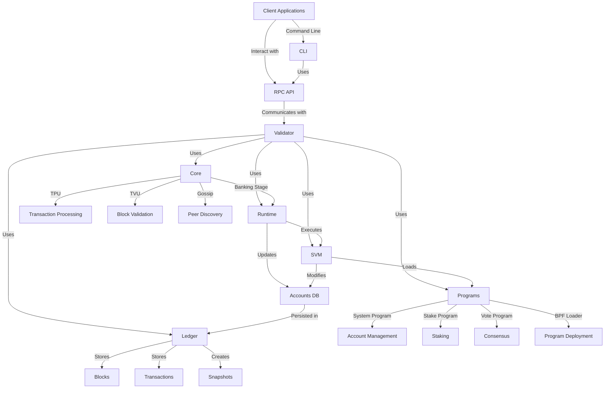
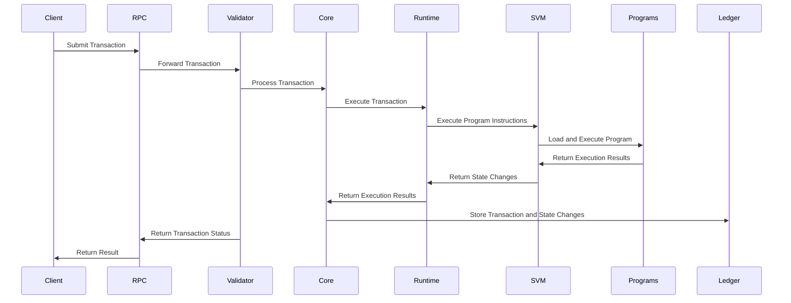
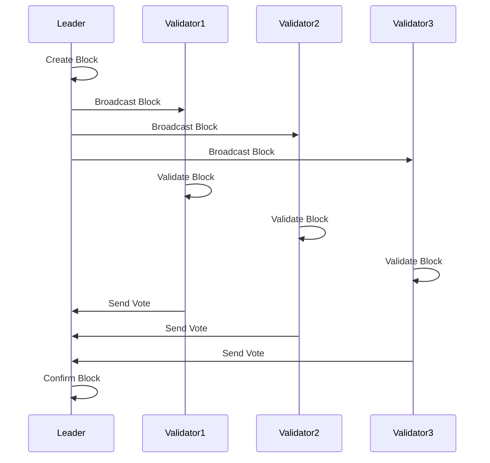
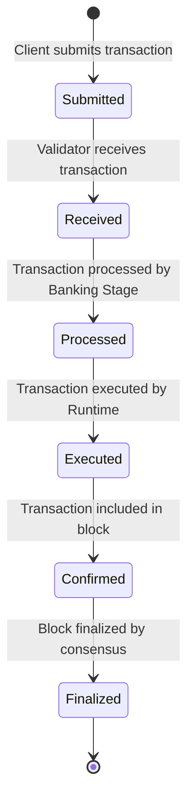
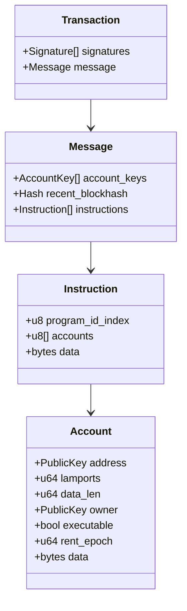

# Agave Blockchain Platform Knowledge Graph

This document provides a comprehensive knowledge graph of the Agave blockchain platform, showing the relationships between different components and their roles in the system.

## System Architecture

## Component Relationships

### Client Interaction Layer
- **Client Applications**: External applications that interact with the blockchain
- **RPC API**: Provides methods for clients to interact with the blockchain
- **CLI**: Command-line tools for interacting with the blockchain

### Validator Node
- **Validator**: The main node implementation that participates in consensus
- **Core**: Central component handling consensus, networking, and transaction processing
- **Runtime**: Executes transactions and manages blockchain state
- **SVM**: Executes smart contracts (programs)
- **Ledger**: Stores and manages blockchain data
- **Programs**: Built-in smart contracts providing core functionality

### Core Components
- **Banking Stage**: Processes and validates transactions
- **TPU (Transaction Processing Unit)**: Receives and processes transactions
- **TVU (Transaction Validation Unit)**: Validates blocks
- **Gossip**: Handles peer discovery and communication

### State Management
- **Accounts DB**: Manages the state of all accounts
- **Runtime**: Updates account states based on transaction execution
- **SVM**: Executes program instructions that modify account states

### Data Storage
- **Ledger**: Stores blocks, transactions, and account states
- **Blocks**: Contains validated transactions
- **Transactions**: Contains instructions to be executed
- **Snapshots**: Point-in-time captures of the blockchain state

### Built-in Programs
- **System Program**: Manages accounts and transfers
- **Stake Program**: Manages staking and delegation
- **Vote Program**: Manages consensus voting
- **BPF Loader**: Deploys and executes user programs

## Data Flow

## Consensus Flow

## Transaction Lifecycle

## Account Structure

## Further Reading

For more detailed information about the Agave blockchain platform, refer to the README.md files in each component directory:

- [Core README](core/README.md)
- [Validator README](validator/README.md)
- [SVM README](svm/README.md)
- [Runtime README](runtime/README.md)
- [Programs README](programs/README.md)
- [Ledger README](ledger/README.md)
- [RPC README](rpc/README.md)
- [CLI README](cli/README.md)