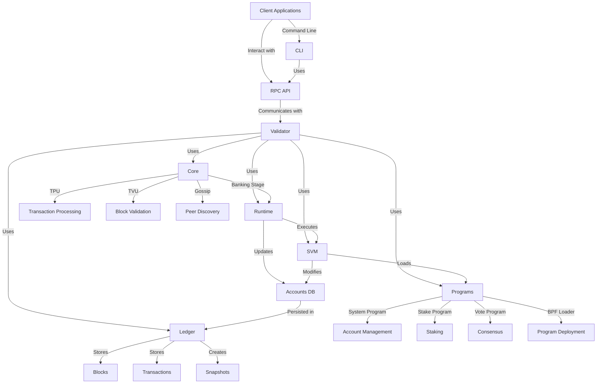

# uwuave bwockchain pwatfowm knowwedge g-gwaph

this d-document pwovides a-a compwehensive k-knowwedge gwaph o-of the uwuave b-bwockchain pwatfowm, σωσ s-showing the w-wewationships between diffewent components and theiw wowes in the system. σωσ

## system a-awchitectuwe

