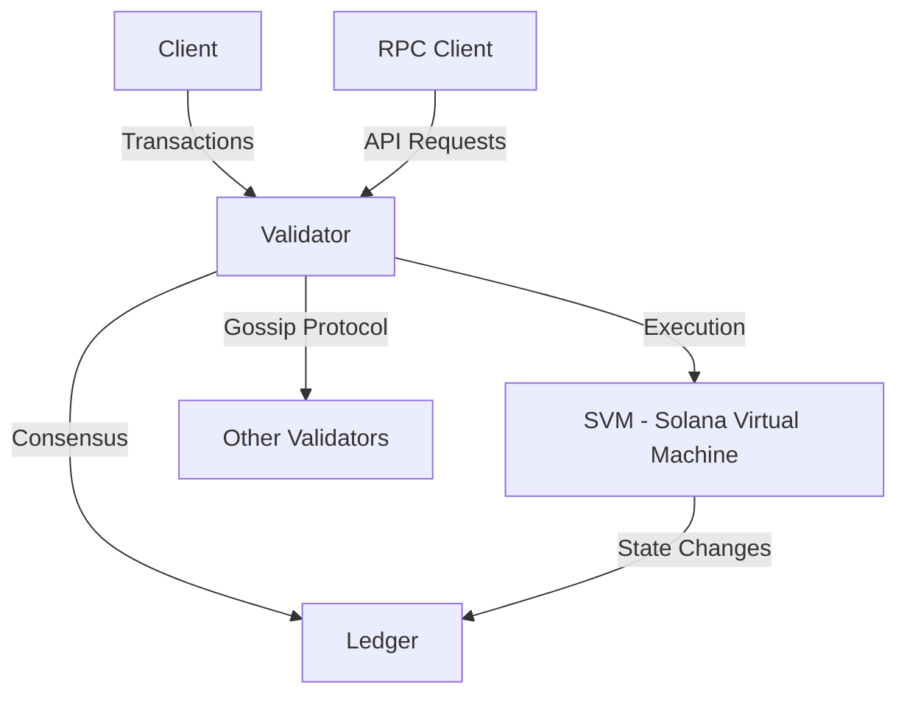

<p align="center">
  <a href="https://solana.com">
    
  </a>
</p>

[](https://crates.io/crates/solana-core)
[](https://docs.rs/solana-core)
[](https://buildkite.com/solana-labs/solana/builds?branch=master)
[](https://codecov.io/gh/solana-labs/solana)

# Agave - A Solana Validator Implementation

Agave is a high-performance blockchain platform designed for scalability and speed. This repository contains the Agave validator implementation, a fork of the Solana blockchain.

## Project Overview

Agave is built on the foundation of Solana's architecture, featuring:

- High throughput with thousands of transactions per second
- Low transaction fees (fractions of a penny)
- Fast block times (~400ms)
- Energy-efficient Proof of Stake consensus mechanism
- Smart contract support via the Solana Virtual Machine (SVM)

### Architecture Overview



## Repository Structure

The repository is organized into several key components:

- **core**: Main blockchain functionality including consensus, networking, and transaction processing
- **validator**: The node implementation that validates transactions and maintains the blockchain
- **svm**: The Solana Virtual Machine that executes smart contracts
- **runtime**: The execution environment for transactions
- **programs**: Built-in smart contracts that provide core functionality
- **ledger**: Storage and management of the blockchain data
- **rpc**: API for interacting with the blockchain
- **cli**: Command-line tools for interacting with the blockchain

## Getting Started

### Building from Source

#### Prerequisites

- Rust and Cargo (latest stable version)
- System dependencies (Ubuntu example):
  ```bash
  sudo apt-get update
  sudo apt-get install libssl-dev libudev-dev pkg-config zlib1g-dev llvm clang cmake make libprotobuf-dev protobuf-compiler libclang-dev
  ```

#### Build Steps

1. Clone the repository:
   ```bash
   git clone https://github.com/anza-xyz/agave.git
   cd agave
   ```

2. Build the project:
   ```bash
   ./cargo build
   ```

For production use, build a release version:
   ```bash
   ./cargo build --release
   ```

### Running a Validator

To run a validator node, see the detailed instructions in the [validator documentation](docs/src/running-validator/validator-start.md).

### Development and Testing

- Run tests: `./cargo test`
- Start a local testnet: See [local testnet documentation](docs/src/clusters/benchmark.md)
- Access the development cluster: Connect to `devnet.solana.com`

## Documentation

Comprehensive documentation is available in the `docs` directory and on the [official documentation website](https://docs.anza.xyz).

## Contributing

Contributions are welcome! Please read our [Contributing Guidelines](CONTRIBUTING.md) before submitting a pull request.

## License

Agave is licensed under the [Apache License 2.0](LICENSE).