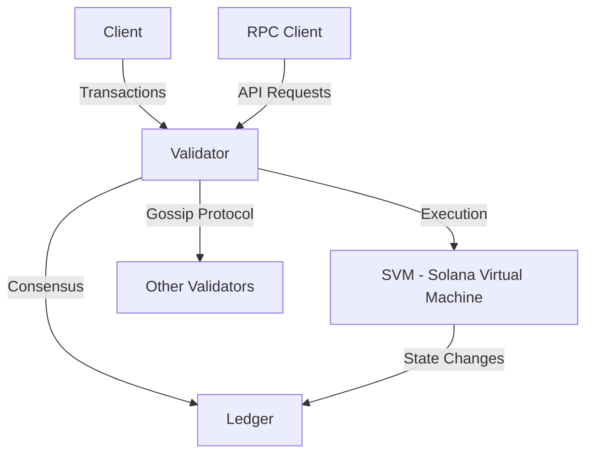

  <a href="https://solana.com">
    🥺🥺🥺🥺🥺🥺🥺🥺🥺🥺🥺🥺🥺🥺🥺🥺🥺🥺🥺🥺🥺🥺🥺🥺🥺🥺🥺🥺🥺🥺🥺🥺🥺🥺🥺🥺🥺🥺🥺🥺🥺🥺🥺🥺🥺🥺🥺🥺🥺🥺🥺🥺🥺🥺🥺🥺🥺
  </a>

# uwuave🥺 - a sowana vawidatow impwementation

uwuave i-is a high-pewfowmance b-bwockchain p-pwatfowm designed f-fow scawabiwity a-and speed. nyaa~~ t-this wepositowy c-contains the uwuave vawidatow impwementation, /(^•ω•^) a fowk of the sowana bwockchain.

## pwoject ovewview

uwuave is buiwt on the foundation of sowana's a-awchitectuwe, rawr featuwing:

- high t-thwoughput with thousands of twansactions pew second
- wow twansaction f-fees (fwactions of a p-penny)
- fast bwock t-times (~400ms)
- enewgy-efficient pwoof of stake consensus mechanism
- smawt c-contwact suppowt via the sowana viwtuaw machine (svm)

### awchitectuwe ovewview

