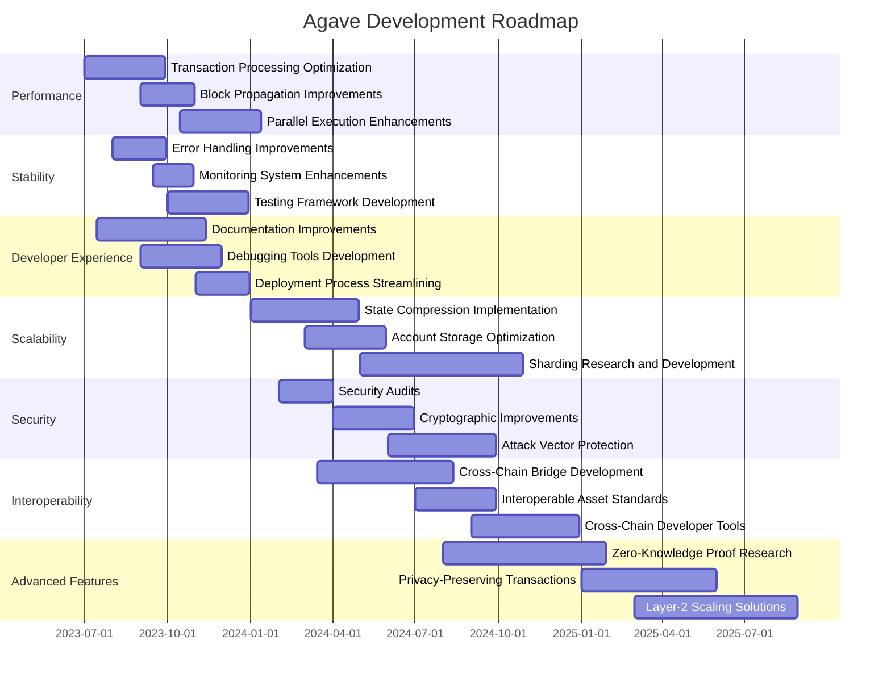

# Agave Blockchain Platform Roadmap

This document outlines the future development plans for the Agave blockchain platform, providing a high-level overview of planned features, improvements, and milestones.

## Current Status

Agave is a fork of the Solana blockchain, focusing on high performance, scalability, and developer experience. The current implementation includes:

- High-throughput blockchain with thousands of transactions per second
- Low-latency block confirmation (~400ms)
- Energy-efficient Proof of Stake consensus
- Smart contract support via the Solana Virtual Machine (SVM)
- Rich ecosystem of developer tools and libraries

## Short-Term Goals (0-6 months)

### Performance Improvements
- [ ] Optimize transaction processing pipeline for higher throughput
- [ ] Reduce block propagation latency
- [ ] Improve validator startup time with optimized snapshot loading
- [ ] Enhance parallel transaction execution

### Stability Enhancements
- [ ] Improve error handling and recovery mechanisms
- [ ] Enhance monitoring and alerting systems
- [ ] Implement more comprehensive testing frameworks
- [ ] Reduce validator resource requirements

### Developer Experience
- [ ] Improve documentation and examples
- [ ] Enhance debugging tools for smart contract developers
- [ ] Streamline deployment processes
- [ ] Provide better error messages and troubleshooting guides

## Medium-Term Goals (6-12 months)

### Scalability Solutions
- [ ] Implement state compression techniques
- [ ] Develop more efficient account storage mechanisms
- [ ] Explore sharding approaches for horizontal scaling
- [ ] Optimize validator resource usage

### Security Enhancements
- [ ] Conduct comprehensive security audits
- [ ] Implement additional security features
- [ ] Improve cryptographic primitives
- [ ] Enhance protection against common attack vectors

### Interoperability
- [ ] Develop bridges to other blockchain ecosystems
- [ ] Implement cross-chain communication protocols
- [ ] Support interoperable asset standards
- [ ] Create developer tools for cross-chain applications

## Long-Term Goals (12+ months)

### Advanced Features
- [ ] Implement zero-knowledge proof capabilities
- [ ] Develop privacy-preserving transaction mechanisms
- [ ] Research and implement layer-2 scaling solutions
- [ ] Explore novel consensus improvements

### Ecosystem Growth
- [ ] Foster development of key infrastructure components
- [ ] Support growth of developer community
- [ ] Encourage adoption by enterprises and institutions
- [ ] Develop educational resources and programs

### Governance and Decentralization
- [ ] Implement on-chain governance mechanisms
- [ ] Increase decentralization of validator network
- [ ] Develop community-driven feature prioritization
- [ ] Create sustainable funding mechanisms for ongoing development

## Technical Milestones

## Research Areas

The Agave team is actively researching several areas to improve the blockchain platform:

### Consensus Mechanisms
- Improvements to the current Proof of Stake consensus
- Hybrid consensus approaches
- Byzantine Fault Tolerance optimizations

### Cryptography
- Post-quantum cryptographic primitives
- Zero-knowledge proof systems
- Threshold signatures and multi-party computation

### Distributed Systems
- Novel sharding approaches
- State synchronization optimizations
- Network topology improvements

### Programming Models
- Enhanced smart contract programming models
- Formal verification techniques
- New abstraction layers for developers

## Community Involvement

The Agave roadmap is not set in stone and will evolve based on community feedback and emerging priorities. Community members are encouraged to:

- Provide feedback on the roadmap
- Suggest new features and improvements
- Contribute to the development of the platform
- Participate in governance discussions

## Conclusion

The Agave blockchain platform aims to be at the forefront of blockchain technology, providing a high-performance, scalable, and developer-friendly environment for building decentralized applications. This roadmap outlines the path forward, but will be regularly updated to reflect new insights, technologies, and community priorities.