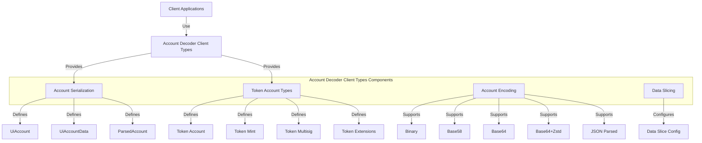

# Agave Account Decoder Client Types

The account-decoder-client-types module provides core data structures and types used by clients to interact with the Agave blockchain's account decoding functionality. It defines the serialization and deserialization formats for account data, enabling consistent representation of blockchain accounts across different client applications.

## Architecture Overview



## Key Components

### Account Serialization
The Account Serialization component defines the data structures used to represent accounts in client applications:

- **UiAccount**: A JSON-friendly representation of an account, including lamports, data, owner, executable flag, and rent epoch
- **UiAccountData**: An enum representing different encodings of account data (Binary, Base58, Base64, Base64+Zstd, JSON Parsed)
- **ParsedAccount**: A structure containing parsed account data in a program-specific format

### Account Encoding
The Account Encoding component defines the different encoding formats for account data:

- **Binary**: Legacy encoding format (retained for backward compatibility)
- **Base58**: Compact encoding suitable for small data
- **Base64**: Standard Base64 encoding
- **Base64+Zstd**: Compressed Base64 encoding using Zstd compression
- **JSON Parsed**: Human-readable JSON representation of parsed account data

### Token Account Types
The Token Account Types component defines the data structures for representing SPL Token accounts:

- **UiTokenAmount**: A structure representing token amounts with both raw and UI-friendly formats
- **TokenAccountType**: An enum representing different types of token accounts (Account, Mint, Multisig)
- **UiTokenAccount**: A structure representing a token account with balance, owner, state, and other properties
- **UiMint**: A structure representing a token mint with supply, decimals, and authorities
- **UiMultisig**: A structure representing a multisig configuration for token accounts

### Token Extensions
The Token Extensions component defines the data structures for representing SPL Token-2022 extensions:

- **UiExtension**: An enum representing different token extensions (TransferFee, ConfidentialTransfer, etc.)
- **Extension-specific structures**: Structures for each extension type with their specific properties

### Data Slicing
The Data Slicing component allows clients to request only a portion of an account's data:

- **UiDataSliceConfig**: A structure defining the offset and length of the data slice to return

## Usage Examples

### Creating a UiAccount from Account Data

```rust
use solana_account_decoder_client_types::{UiAccount, UiAccountData, UiAccountEncoding};
use solana_account::Account;
use solana_pubkey::Pubkey;

// Create a UiAccount from an Account
let account = Account {
    lamports: 1000,
    data: vec![0, 1, 2, 3],
    owner: Pubkey::new_unique(),
    executable: false,
    rent_epoch: 0,
};

let ui_account = UiAccount {
    lamports: account.lamports,
    data: UiAccountData::Binary(
        base64::encode(&account.data),
        UiAccountEncoding::Base64,
    ),
    owner: account.owner.to_string(),
    executable: account.executable,
    rent_epoch: account.rent_epoch,
    space: Some(account.data.len() as u64),
};
```

### Decoding Account Data

```rust
use solana_account_decoder_client_types::{UiAccount, UiAccountData, UiAccountEncoding};
use solana_account::Account;

// Decode account data from a UiAccount
let ui_account = /* get UiAccount from somewhere */;

match ui_account.data {
    UiAccountData::Binary(encoded_data, encoding) => {
        match encoding {
            UiAccountEncoding::Base58 => {
                let decoded = bs58::decode(&encoded_data).into_vec().unwrap();
                println!("Decoded data: {:?}", decoded);
            },
            UiAccountEncoding::Base64 => {
                let decoded = base64::decode(&encoded_data).unwrap();
                println!("Decoded data: {:?}", decoded);
            },
            // Handle other encodings...
            _ => println!("Unsupported encoding"),
        }
    },
    UiAccountData::Json(parsed_data) => {
        println!("Parsed data: {:?}", parsed_data);
    },
    UiAccountData::LegacyBinary(encoded_data) => {
        let decoded = bs58::decode(&encoded_data).into_vec().unwrap();
        println!("Decoded data: {:?}", decoded);
    },
}

// Alternatively, use the decode method
if let Some(account) = ui_account.decode::<Account>() {
    println!("Decoded account: {:?}", account);
}
```

### Working with Token Amounts

```rust
use solana_account_decoder_client_types::token::UiTokenAmount;

// Create a UiTokenAmount
let token_amount = UiTokenAmount {
    ui_amount: Some(1.5),
    decimals: 6,
    amount: "1500000".to_string(),
    ui_amount_string: "1.5".to_string(),
};

// Get the real number string representation
let amount_str = token_amount.real_number_string();
assert_eq!(amount_str, "1.500000");

// Get the trimmed real number string representation
let trimmed_str = token_amount.real_number_string_trimmed();
assert_eq!(trimmed_str, "1.5");
```

### Configuring Data Slicing

```rust
use solana_account_decoder_client_types::UiDataSliceConfig;

// Create a data slice configuration
let slice_config = UiDataSliceConfig {
    offset: 0,
    length: 100, // Get only the first 100 bytes
};

// Use the slice configuration when requesting account data
// from an RPC endpoint
```

## Development

### Building

To build the account-decoder-client-types module:

```bash
cd account-decoder-client-types
cargo build
```

### Testing

To run the tests for the account-decoder-client-types module:

```bash
cd account-decoder-client-types
cargo test
```

## Further Reading

For more detailed information about account decoding and client types, refer to the following resources:

- [Account Structure](https://docs.anza.xyz/developing/programming-model/accounts)
- [RPC API Reference](https://docs.anza.xyz/api/http)
- [Token Program](https://spl.solana.com/token)
- [Token-2022 Program](https://spl.solana.com/token-2022)