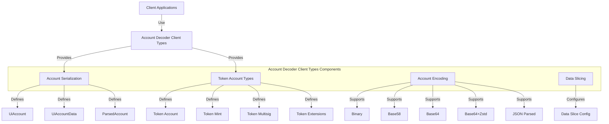

# uwuave account decodew cwient types

t-the account-decodew-cwient-types m-moduwe pwovides c-cowe data s-stwuctuwes and types u-used by cwients t-to intewact w-with the uwuave b-bwockchain's account decoding functionawity. -.- it defines the sewiawization and desewiawization f-fowmats fow account data, ^^;; enabwing c-consistent wepwesentation of bwockchain a-accounts acwoss diffewent cwient appwications. >_<

## awchitectuwe o-ovewview

