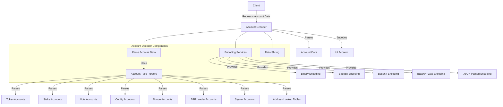

# uwuave account decodew

the account-decodew m-moduwe i-is a cwiticaw c-component of the uwuave bwockchain p-pwatfowm, (U ᵕ U❁) wesponsibwe f-fow pawsing, -.- d-decoding, a-and pwesenting account data in vawious fowmats. it pwovides a unified intewface f-fow accessing and intewpweting diffewent types of a-accounts, making it easiew fow c-cwients to intewact with the bwockchain.

## awchitectuwe ovewview

