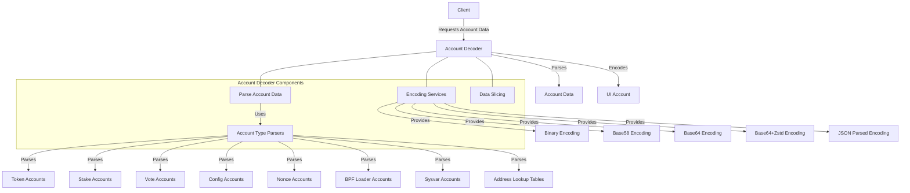

# Agave Account Decoder

The account-decoder module is a critical component of the Agave blockchain platform, responsible for parsing, decoding, and presenting account data in various formats. It provides a unified interface for accessing and interpreting different types of accounts, making it easier for clients to interact with the blockchain.

## Architecture Overview



## Key Components

### Parse Account Data
The Parse Account Data component is the main entry point for parsing account data. It identifies the account type based on the program ID and delegates the parsing to the appropriate account type parser. It supports various account types, including token accounts, stake accounts, vote accounts, and more.

### Account Type Parsers
The Account Type Parsers are specialized components for parsing specific types of accounts:

- **Token Parser**: Parses SPL Token and Token-2022 accounts
- **Stake Parser**: Parses stake accounts and stake delegation information
- **Vote Parser**: Parses vote accounts and voting history
- **Config Parser**: Parses configuration accounts
- **Nonce Parser**: Parses nonce accounts used for durable transaction nonces
- **BPF Loader Parser**: Parses BPF Upgradeable Loader accounts
- **Sysvar Parser**: Parses system variable accounts
- **Address Lookup Table Parser**: Parses address lookup table accounts

### Encoding Services
The Encoding Services component provides various encoding formats for account data:

- **Binary Encoding**: Raw binary data encoded as Base58 or Base64
- **Base58 Encoding**: Compact encoding suitable for small data
- **Base64 Encoding**: Standard Base64 encoding
- **Base64+Zstd Encoding**: Compressed Base64 encoding using Zstd compression
- **JSON Parsed Encoding**: Human-readable JSON representation of parsed account data

### Data Slicing
The Data Slicing component allows clients to request only a portion of an account's data, reducing bandwidth usage and improving performance for large accounts.

## Account Parsing Process

The account parsing process follows these steps:

1. **Program Identification**: The account's owner (program ID) is used to identify the account type
2. **Parser Selection**: The appropriate parser is selected based on the account type
3. **Data Parsing**: The account data is parsed according to the account type's data structure
4. **Result Formatting**: The parsed data is formatted according to the requested encoding
5. **Response Generation**: The formatted data is returned to the client

## Supported Account Types

The account-decoder module supports the following account types:

- **SPL Token Accounts**: Token accounts, mint accounts, and token metadata
- **Stake Accounts**: Stake delegation accounts and stake history
- **Vote Accounts**: Validator vote accounts and vote history
- **Config Accounts**: Configuration accounts for various programs
- **Nonce Accounts**: Durable transaction nonce accounts
- **BPF Loader Accounts**: Program accounts and buffer accounts
- **Sysvar Accounts**: System variable accounts (clock, rent, etc.)
- **Address Lookup Table Accounts**: Address lookup tables for transaction compression

## Usage Examples

### Parsing an Account with JSON Encoding

```rust
use solana_account_decoder::{
    parse_account_data_v3, 
    UiAccountEncoding, 
    encode_ui_account
};
use solana_pubkey::Pubkey;
use solana_account::AccountSharedData;

// Get account data from somewhere
let pubkey = Pubkey::from_str("83astBRguLMdt2h5U1Tpdq5tjFoJ6noeGwaY3mDLVcri").unwrap();
let account = /* get account */;

// Parse the account data with JSON encoding
let ui_account = encode_ui_account(
    &pubkey,
    &account,
    UiAccountEncoding::JsonParsed,
    None,
    None,
);

// Access the parsed data
match ui_account.data {
    UiAccountData::Json(parsed_data) => {
        println!("Parsed account data: {:?}", parsed_data);
    },
    _ => {
        println!("Account data could not be parsed as JSON");
    }
}
```

### Parsing a Token Account

```rust
use solana_account_decoder::{
    parse_token_v3,
    SplTokenAdditionalDataV2
};

// Get token account data from somewhere
let token_account_data = /* get token account data */;

// Parse the token account with decimals information
let token_decimals = 9;
let additional_data = Some(SplTokenAdditionalDataV2::with_decimals(token_decimals));
let parsed_token = parse_token_v3(token_account_data, additional_data.as_ref()).unwrap();

println!("Token balance: {}", parsed_token.token_amount.ui_amount.unwrap());
```

### Slicing Account Data

```rust
use solana_account_decoder::{
    UiDataSliceConfig,
    encode_ui_account,
    UiAccountEncoding
};

// Get account data from somewhere
let pubkey = /* account public key */;
let account = /* get account */;

// Request only a portion of the account data
let slice_config = Some(UiDataSliceConfig {
    offset: 0,
    length: 100, // Get only the first 100 bytes
});

let ui_account = encode_ui_account(
    &pubkey,
    &account,
    UiAccountEncoding::Base64,
    None,
    slice_config,
);

println!("Sliced account data: {:?}", ui_account.data);
```

## Development

### Building

To build the account-decoder module:

```bash
cd account-decoder
cargo build
```

### Testing

To run the tests for the account-decoder module:

```bash
cd account-decoder
cargo test
```

## Further Reading

For more detailed information about account decoding, refer to the following resources:

- [Account Structure](https://docs.anza.xyz/developing/programming-model/accounts)
- [RPC API Reference](https://docs.anza.xyz/api/http)
- [Token Program](https://spl.solana.com/token)
- [Stake Program](https://docs.anza.xyz/staking/stake-accounts)
- [Vote Program](https://docs.anza.xyz/validator/vote-accounts)