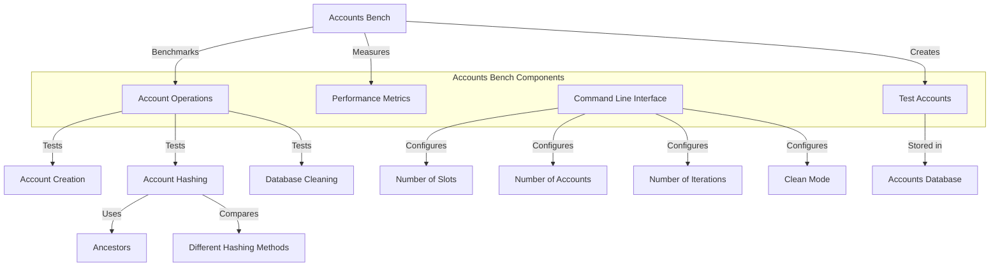

# Agave Accounts Bench

The accounts-bench module is a benchmarking tool for the Agave blockchain platform's accounts database. It provides utilities for measuring the performance of various accounts-related operations, such as account creation, account hashing, and database cleaning. This tool is essential for evaluating the efficiency and scalability of the accounts database under different workloads.

## Architecture Overview



## Key Components

### Command Line Interface
The Command Line Interface component provides options for configuring the benchmark parameters:

- **Number of Slots**: The number of slots to store accounts to
- **Number of Accounts**: The total number of accounts to create
- **Number of Iterations**: The number of benchmark iterations to run
- **Clean Mode**: Whether to run the database cleaning benchmark

### Test Accounts
The Test Accounts component creates a specified number of test accounts distributed across multiple slots. These accounts are used as the dataset for benchmarking various operations.

### Performance Metrics
The Performance Metrics component measures and reports the performance of various operations:

- **Creation Time**: Time taken to create accounts
- **Hashing Time**: Time taken to hash accounts using different methods
- **Cleaning Time**: Time taken to clean the accounts database

### Account Operations
The Account Operations component benchmarks various operations on the accounts database:

- **Account Creation**: Creating a large number of accounts across multiple slots
- **Account Hashing**: Computing the hash of all accounts in the database
- **Database Cleaning**: Cleaning the accounts database to reclaim space

## Benchmark Process

The accounts-bench tool follows these steps:

1. **Setup**: Create a temporary accounts database
2. **Account Creation**: Create a specified number of accounts across multiple slots
3. **Benchmark Iterations**: Run multiple iterations of the selected benchmark
4. **Measurement**: Measure and report the performance of each operation
5. **Comparison**: Compare different methods for the same operation (e.g., different hashing methods)

## Usage Examples

### Basic Usage

```bash
# Run the benchmark with default parameters
solana-accounts-bench
```

### Configuring the Benchmark

```bash
# Run the benchmark with custom parameters
solana-accounts-bench --num_slots 8 --num_accounts 100000 --iterations 50
```

### Running the Clean Benchmark

```bash
# Run the database cleaning benchmark
solana-accounts-bench --clean
```

### Full Configuration Example

```bash
# Run the benchmark with all parameters specified
solana-accounts-bench --num_slots 16 --num_accounts 1000000 --iterations 100 --clean
```

## Performance Considerations

The accounts-bench tool is designed to measure the performance of the accounts database under various conditions. When interpreting the results, consider the following factors:

- **Hardware Specifications**: CPU, memory, and disk speed significantly impact performance
- **Database Size**: Larger databases generally result in longer operation times
- **Account Distribution**: The distribution of accounts across slots affects performance
- **Parallelism**: Many operations are parallelized, so multi-core CPUs provide better performance
- **Storage Type**: SSD vs. HDD storage has a significant impact on I/O-bound operations

## Development

### Building

To build the accounts-bench module:

```bash
cd accounts-bench
cargo build --release
```

### Running

To run the accounts-bench tool:

```bash
cd accounts-bench
cargo run --release -- [OPTIONS]
```

## Further Reading

For more detailed information about the accounts database and benchmarking, refer to the following resources:

- [Accounts Database Architecture](https://docs.anza.xyz/validator/accounts)
- [Performance Optimization](https://docs.anza.xyz/validator/performance-tuning)
- [Validator Requirements](https://docs.anza.xyz/running-validator/validator-reqs)