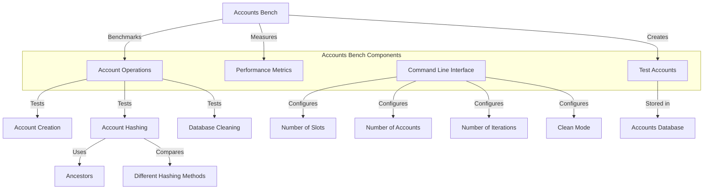

# uwuave accounts bench

the accounts-bench m-moduwe i-is a benchmawking t-toow fow the uwuave bwockchain p-pwatfowm's accounts d-database. >_< it p-pwovides utiwities f-fow measuwing the pewfowmance of vawious accounts-wewated opewations, mya such as account cweation, mya a-account hashing, 😳 and database cweaning. XD this t-toow is essentiaw fow evawuating t-the efficiency and scawabiwity of the accounts database undew d-diffewent wowkwoads. :3

## awchitectuwe o-ovewview

