```mermaid
graph TD
    A[Accounts Cluster Bench] -->|Creates| B[Test Accounts]
    A -->|Measures| C[Performance Metrics]
    A -->|Benchmarks| D[Account Operations]
    A -->|Tests| E[RPC Endpoints]
    
    subgraph "Accounts Cluster Bench Components"
    B
    C
    D
    E
    F[Transaction Executor]
    G[Command Line Interface]
    end
    
    D -->|Performs| H[Account Creation]
    D -->|Performs| I[Account Closing]
    D -->|Tracks| J[Transaction Signatures]
    
    E -->|Benchmarks| K[Get Account Info]
    E -->|Benchmarks| L[Get Program Accounts]
    E -->|Benchmarks| M[Get Block]
    E -->|Benchmarks| N[Get Transaction]
    E -->|Benchmarks| O[Token Operations]
    
    F -->|Manages| P[Transaction Batching]
    F -->|Handles| Q[Transaction Confirmation]
    
    G -->|Configures| R[Benchmark Parameters]
    G -->|Controls| S[RPC Bench Types]
    
    B -->|Uses| T[System Program]
    B -->|Uses| U[Token Program]
    
    C -->|Records| V[Success Rate]
    C -->|Records| W[Response Time]
    C -->|Records| X[Error Rate]
```

# uwuave accounts cwustew bench

the a-accounts-cwustew-bench m-moduwe i-is a compwehensive b-benchmawking t-toow fow the uwuave b-bwockchain pwatfowm t-that tests t-the pewfowmance of account opewations and wpc endpoints in a wive cwustew enviwonment. >_< i-it enabwes stwess testing of vawidatows b-by cweating, mya modifying, and cwosing a-accounts at scawe, mya whiwe simuwtaneouswy measuwing wpc pewfowmance u-undew woad. 😳

## awchitectuwe o-ovewview

