# Agave Accounts Cluster Bench

The accounts-cluster-bench module is a comprehensive benchmarking tool for the Agave blockchain platform that tests the performance of account operations and RPC endpoints in a live cluster environment. It enables stress testing of validators by creating, modifying, and closing accounts at scale, while simultaneously measuring RPC performance under load.

## Architecture Overview

```mermaid
graph TD
    A[Accounts Cluster Bench] -->|Creates| B[Test Accounts]
    A -->|Measures| C[Performance Metrics]
    A -->|Benchmarks| D[Account Operations]
    A -->|Tests| E[RPC Endpoints]
    
    subgraph "Accounts Cluster Bench Components"
    B
    C
    D
    E
    F[Transaction Executor]
    G[Command Line Interface]
    end
    
    D -->|Performs| H[Account Creation]
    D -->|Performs| I[Account Closing]
    D -->|Tracks| J[Transaction Signatures]
    
    E -->|Benchmarks| K[Get Account Info]
    E -->|Benchmarks| L[Get Program Accounts]
    E -->|Benchmarks| M[Get Block]
    E -->|Benchmarks| N[Get Transaction]
    E -->|Benchmarks| O[Token Operations]
    
    F -->|Manages| P[Transaction Batching]
    F -->|Handles| Q[Transaction Confirmation]
    
    G -->|Configures| R[Benchmark Parameters]
    G -->|Controls| S[RPC Bench Types]
    
    B -->|Uses| T[System Program]
    B -->|Uses| U[Token Program]
    
    C -->|Records| V[Success Rate]
    C -->|Records| W[Response Time]
    C -->|Records| X[Error Rate]
```



## Key Components

### Command Line Interface
The Command Line Interface component provides extensive options for configuring the benchmark parameters:

- **JSON RPC URL**: The URL of the JSON RPC endpoint to benchmark
- **Entrypoint**: The entrypoint address for discovering the cluster
- **Space**: The size of accounts to create
- **Lamports**: The amount of lamports to fund each account with
- **Identity**: The keypair files to use for transactions
- **Batch Size**: The number of transactions to send per batch
- **Close Frequency**: How often to close accounts
- **Iterations**: The number of benchmark iterations to run
- **Max Accounts**: The maximum number of accounts to create
- **RPC Bench Types**: The types of RPC endpoints to benchmark

### Transaction Executor
The Transaction Executor component manages the lifecycle of transactions:

- **Transaction Creation**: Creates transactions for account operations
- **Transaction Submission**: Submits transactions to the network
- **Transaction Confirmation**: Tracks transaction confirmations
- **Transaction Batching**: Groups transactions into batches for efficient processing

### Account Operations
The Account Operations component performs various operations on accounts:

- **Account Creation**: Creates accounts with specified parameters
- **Account Closing**: Closes accounts and reclaims lamports
- **Token Account Operations**: Creates and manages token accounts
- **Transaction Signature Tracking**: Tracks transaction signatures for later verification

### RPC Benchmarking
The RPC Benchmarking component tests the performance of various RPC endpoints:

- **Version**: Tests the `getVersion` endpoint
- **Slot**: Tests the `getSlot` endpoint
- **Multiple Accounts**: Tests the `getMultipleAccounts` endpoint
- **Program Accounts**: Tests the `getProgramAccounts` endpoint
- **Token Accounts**: Tests token-related endpoints
- **Block**: Tests block-related endpoints
- **Transaction**: Tests transaction-related endpoints

### Performance Metrics
The Performance Metrics component measures and reports the performance of various operations:

- **Success Rate**: The percentage of successful operations
- **Response Time**: The time taken to complete operations
- **Error Rate**: The percentage of operations that resulted in errors
- **Throughput**: The number of operations completed per second

## Benchmark Process

The accounts-cluster-bench tool follows these steps:

1. **Setup**: Connect to the specified RPC endpoint or discover the cluster
2. **Account Creation**: Create a specified number of accounts across multiple slots
3. **RPC Benchmarking**: Run benchmarks against various RPC endpoints
4. **Account Closing**: Optionally close accounts to reclaim lamports
5. **Measurement**: Measure and report the performance of each operation

## Usage Examples

### Basic Usage

```bash
# Run the benchmark with default parameters
solana-accounts-cluster-bench --url https://api.mainnet-beta.solana.com --identity keypair.json
```

### Benchmarking Account Creation

```bash
# Create accounts with specific parameters
solana-accounts-cluster-bench \
  --url https://api.devnet.solana.com \
  --identity keypair.json \
  --space 1000 \
  --lamports 10000 \
  --batch-size 100 \
  --iterations 10
```

### Benchmarking RPC Endpoints

```bash
# Benchmark specific RPC endpoints
solana-accounts-cluster-bench \
  --url https://api.devnet.solana.com \
  --identity keypair.json \
  --rpc-bench account-info \
  --rpc-bench program-accounts \
  --rpc-bench transaction \
  --num-rpc-bench-threads 4
```

### Token Account Operations

```bash
# Create and manage token accounts
solana-accounts-cluster-bench \
  --url https://api.devnet.solana.com \
  --identity keypair.json \
  --mint TokenMintAddress \
  --batch-size 50 \
  --iterations 5
```

### Full Configuration Example

```bash
# Run a comprehensive benchmark
solana-accounts-cluster-bench \
  --url https://api.devnet.solana.com \
  --identity keypair1.json \
  --identity keypair2.json \
  --space 2048 \
  --lamports 100000 \
  --batch-size 200 \
  --close-frequency 5 \
  --num-instructions 10 \
  --iterations 20 \
  --max-accounts 10000 \
  --rpc-bench account-info \
  --rpc-bench program-accounts \
  --rpc-bench transaction \
  --num-rpc-bench-threads 8 \
  --reclaim-accounts
```

## Available RPC Bench Types

The following RPC bench types are available for benchmarking:

- `version`: Tests the `getVersion` endpoint
- `slot`: Tests the `getSlot` endpoint
- `multiple-accounts`: Tests the `getMultipleAccounts` endpoint
- `program-accounts`: Tests the `getProgramAccounts` endpoint
- `token-accounts-by-owner`: Tests the `getTokenAccountsByOwner` endpoint
- `token-accounts-by-delegate`: Tests the `getTokenAccountsByDelegate` endpoint
- `supply`: Tests the `getTokenSupply` endpoint
- `account-info`: Tests the `getAccountInfo` endpoint
- `transaction`: Tests the `getTransaction` endpoint with Base64 encoding
- `transaction-parsed`: Tests the `getTransaction` endpoint with JSON parsing
- `block`: Tests the `getBlock` endpoint
- `blocks`: Tests the `getBlocks` endpoint
- `first-available-block`: Tests the `getFirstAvailableBlock` endpoint

## Performance Considerations

When running the accounts-cluster-bench tool, consider the following factors:

- **Network Conditions**: Network latency and congestion can significantly impact results
- **Validator Load**: Validators under heavy load may exhibit different performance characteristics
- **RPC Node Configuration**: Different RPC node configurations can lead to different performance results
- **Client Resources**: Ensure the client machine has sufficient CPU, memory, and network bandwidth
- **Rate Limiting**: Be aware of any rate limiting on the RPC endpoints being tested

## Development

### Building

To build the accounts-cluster-bench module:

```bash
cd accounts-cluster-bench
cargo build --release
```

### Running

To run the accounts-cluster-bench tool:

```bash
cd accounts-cluster-bench
cargo run --release -- [OPTIONS]
```

### Testing

The accounts-cluster-bench module includes several tests:

```bash
cd accounts-cluster-bench
cargo test
```

## Further Reading

For more detailed information about account operations and benchmarking, refer to the following resources:

- [Accounts Model](https://docs.anza.xyz/developing/programming-model/accounts)
- [RPC API Reference](https://docs.anza.xyz/api/http)
- [Performance Optimization](https://docs.anza.xyz/validator/performance-tuning)
- [Token Program](https://spl.solana.com/token)