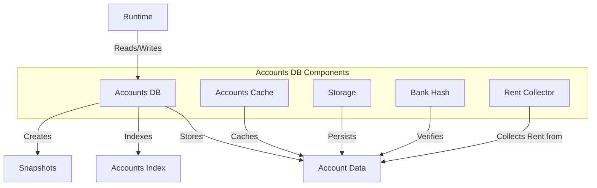

# Agave Accounts Database

The accounts-db module is responsible for storing and managing the state of all accounts on the Agave blockchain. It provides efficient mechanisms for reading, writing, and caching account data, as well as for creating snapshots of the account state.

## Architecture Overview



## Key Components

### Accounts Cache
The Accounts Cache provides in-memory caching of account data to minimize disk I/O and improve performance. It uses a least-recently-used (LRU) strategy to manage cache entries and optimize memory usage.

### Accounts Index
The Accounts Index maintains a mapping from account addresses (public keys) to their storage locations. It supports efficient lookups and updates, and includes optimizations for handling large numbers of accounts.

### Storage
The Storage component manages the persistent storage of account data. It uses append-only files to store account data efficiently and supports various operations such as:
- Appending new account versions
- Reading account data
- Cleaning up old account versions
- Shrinking storage to reclaim space

### Bank Hash
The Bank Hash component computes and verifies the hash of all accounts in a bank (a point-in-time snapshot of the blockchain state). This hash is used to verify the integrity of the accounts database and ensure consistency across validators.

### Rent Collector
The Rent Collector is responsible for collecting rent from accounts based on their size and balance. Accounts that don't maintain sufficient balance to pay rent may be purged from the database.

### Snapshots
The Snapshots component creates point-in-time snapshots of the accounts database, which are used for:
- Fast validator startup
- State synchronization
- Backup and recovery

## Data Model

### Account
An account in the Agave blockchain contains:
- **Address**: The public key that identifies the account
- **Lamports**: The account balance in the smallest unit of SOL
- **Owner**: The program that owns the account and can modify its data
- **Data**: The account's data, which is interpreted by its owner program
- **Executable**: Whether the account contains executable code
- **Rent Epoch**: The epoch at which rent will next be collected

### Storage Format
Account data is stored in append-only files, with each account version containing:
- **Meta**: Account metadata (owner, lamports, etc.)
- **Data**: The account's data
- **Hash**: A hash of the account data for integrity verification

## Performance Optimizations

The accounts-db includes various optimizations to maximize throughput and minimize latency:

- **Parallel Processing**: Many operations are parallelized to take advantage of multiple CPU cores
- **Memory-Mapped Files**: Account data is accessed via memory-mapped files for efficient I/O
- **Incremental Snapshots**: Snapshots can be created incrementally to reduce resource usage
- **Bloom Filters**: Used to quickly check for account existence
- **Bucket Map**: A specialized data structure for efficient account indexing
- **Write Caching**: Writes are cached and batched for improved performance

## Usage Examples

### Reading an Account

```rust
use solana_runtime::bank::Bank;
use solana_sdk::pubkey::Pubkey;

// Get an account from the bank
let pubkey = Pubkey::from_str("83astBRguLMdt2h5U1Tpdq5tjFoJ6noeGwaY3mDLVcri").unwrap();
let account = bank.get_account(&pubkey);

if let Some(account) = account {
    println!("Account balance: {}", account.lamports());
    println!("Account owner: {}", account.owner());
    println!("Account data length: {}", account.data().len());
}
```

### Creating a Snapshot

```rust
use solana_runtime::snapshot_utils::{self, SnapshotVersion};

// Create a full snapshot
let snapshot_path = snapshot_utils::create_snapshot(
    bank,
    vec![],
    snapshot_dir,
    None,
    SnapshotVersion::default(),
    None,
).unwrap();

println!("Created snapshot at: {}", snapshot_path.display());
```

### Loading from a Snapshot

```rust
use solana_runtime::snapshot_utils;

// Load from a snapshot
let (bank, _) = snapshot_utils::bank_from_archive(
    account_paths,
    snapshot_path,
    None,
    genesis_config,
    None,
    None,
    AccountSecondaryIndexes::default(),
    false,
    None,
    None,
    None,
    None,
).unwrap();

println!("Loaded bank from snapshot, slot: {}", bank.slot());
```

## Configuration

The accounts-db can be configured via various parameters:

- **Accounts Index Memory Limit**: Controls the maximum memory usage for the accounts index
- **Accounts Hash Verification Frequency**: Controls how often the accounts hash is verified
- **Snapshot Configuration**: Controls how and when snapshots are created
- **Storage Size**: Controls the size of individual storage files
- **Cache Size**: Controls the size of the accounts cache

## Development

### Building

To build the accounts-db module:

```bash
cd accounts-db
cargo build
```

### Testing

To run the tests for the accounts-db module:

```bash
cd accounts-db
cargo test
```

### Benchmarking

The accounts-db module includes benchmarks for performance-critical components:

```bash
cd accounts-db
cargo bench
```

## Further Reading

For more detailed information about the accounts database, refer to the following resources:

- [Accounts Architecture](https://docs.anza.xyz/validator/accounts)
- [State Management](https://docs.anza.xyz/validator/state-management)
- [Snapshot System](https://docs.anza.xyz/validator/snapshot-system)
- [Rent Economics](https://docs.anza.xyz/economics/rent)