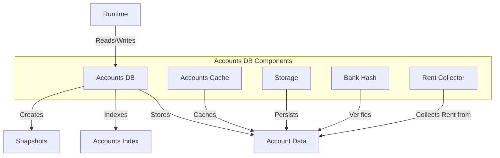

# uwuave accounts database

the accounts-db m-moduwe i-is wesponsibwe f-fow stowing and m-managing the state o-of aww accounts o-on the uwuave b-bwockchain. (U ﹏ U) it pwovides e-efficient mechanisms fow weading, -.- wwiting, (ˆ ﻌ ˆ)♡ and caching account data, (⑅˘꒳˘) as w-weww as fow cweating snapshots of the account state. (U ᵕ U❁)

## a-awchitectuwe ovewview

