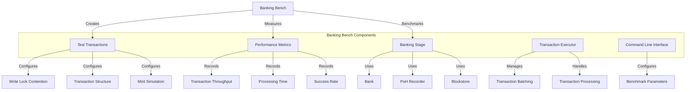

# Agave Banking Bench

The banking-bench module is a benchmarking tool for the Agave blockchain platform's banking stage, which is responsible for processing transactions before they are included in blocks. This tool enables performance testing of transaction processing under various conditions, including different levels of write lock contention, transaction structures, and banking thread configurations.

## Architecture Overview



## Key Components

### Command Line Interface
The Command Line Interface component provides options for configuring the benchmark parameters:

- **Iterations**: Number of test iterations to run
- **Num Chunks**: Number of transaction chunks to create
- **Packets Per Batch**: Number of packets in each batch
- **Batches Per Iteration**: Number of batches to send in each iteration
- **Write Lock Contention**: Level of account write lock contention (None, SameBatchOnly, Full)
- **Block Production Method**: Method used for block production
- **Transaction Structure**: Structure of transactions
- **Num Banking Threads**: Number of threads to use in the banking stage
- **Simulate Mint**: Whether to simulate mint transactions with higher priority
- **Mint Txs Percentage**: Percentage of transactions that are mint transactions

### Transaction Generator
The Transaction Generator component creates test transactions with configurable properties:

- **Account Creation**: Creates accounts for testing
- **Transaction Creation**: Creates transactions with specified parameters
- **Write Lock Contention**: Controls the level of account write lock contention
- **Mint Simulation**: Simulates mint transactions with higher priority

### Banking Stage Benchmarker
The Banking Stage Benchmarker component tests the performance of the banking stage:

- **Transaction Processing**: Measures the performance of transaction processing
- **Bank Management**: Creates and manages banks for testing
- **PoH Integration**: Integrates with the PoH recorder for transaction confirmation
- **Thread Configuration**: Tests different banking thread configurations

### Performance Metrics
The Performance Metrics component measures and reports the performance of the banking stage:

- **Transaction Throughput**: Transactions processed per second
- **Processing Time**: Time taken to process transactions
- **Success Rate**: Percentage of transactions successfully processed

## Write Lock Contention Modes

The banking-bench tool supports three modes of write lock contention:

- **None**: No transactions lock the same accounts, allowing maximum parallelism
- **SameBatchOnly**: Transactions don't lock the same account unless they belong to the same batch
- **Full**: All transactions write lock the same account, creating maximum contention

## Usage Examples

### Basic Usage

```bash
# Run the benchmark with default parameters
solana-banking-bench
```

### Configuring Transaction Parameters

```bash
# Run the benchmark with custom transaction parameters
solana-banking-bench \
  --iterations 100 \
  --num-chunks 32 \
  --packets-per-batch 256 \
  --batches-per-iteration 8
```

### Testing Write Lock Contention

```bash
# Test with different write lock contention modes
solana-banking-bench --write-lock-contention none
solana-banking-bench --write-lock-contention same-batch-only
solana-banking-bench --write-lock-contention full
```

### Testing Banking Thread Configurations

```bash
# Test with different numbers of banking threads
solana-banking-bench --num-banking-threads 4
solana-banking-bench --num-banking-threads 8
solana-banking-bench --num-banking-threads 16
```

### Simulating Mint Transactions

```bash
# Simulate mint transactions with higher priority
solana-banking-bench --simulate-mint --mint-txs-percentage 50
```

## Performance Considerations

When interpreting the results of the banking-bench tool, consider the following factors:

- **Write Lock Contention**: Higher contention generally leads to lower throughput
- **Number of Banking Threads**: More threads can improve throughput up to a point
- **Transaction Structure**: Different transaction structures can affect processing efficiency
- **Batch Size**: Larger batches may improve throughput but increase latency
- **Hardware Resources**: CPU, memory, and disk speed significantly impact performance

## Development

### Building

To build the banking-bench module:

```bash
cd banking-bench
cargo build --release
```

### Running

To run the banking-bench tool:

```bash
cd banking-bench
cargo run --release -- [OPTIONS]
```

## Further Reading

For more detailed information about the banking stage and transaction processing, refer to the following resources:

- [Transaction Processing](https://docs.anza.xyz/validator/transaction-processing)
- [Banking Stage Architecture](https://docs.anza.xyz/validator/banking-stage)
- [Performance Optimization](https://docs.anza.xyz/validator/performance-tuning)