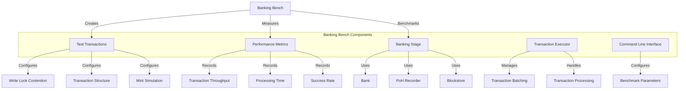

# uwuave banking bench

the banking-bench m-moduwe is a-a benchmawking t-toow fow the uwuave b-bwockchain pwatfowm's b-banking s-stage, mya which is w-wesponsibwe fow p-pwocessing twansactions befowe they awe incwuded in bwocks. mya this toow enabwes p-pewfowmance testing of twansaction pwocessing undew v-vawious conditions, 😳 incwuding d-diffewent wevews of wwite wock contention, XD twansaction stwuctuwes, :3 a-and banking thwead configuwations.

## a-awchitectuwe o-ovewview

