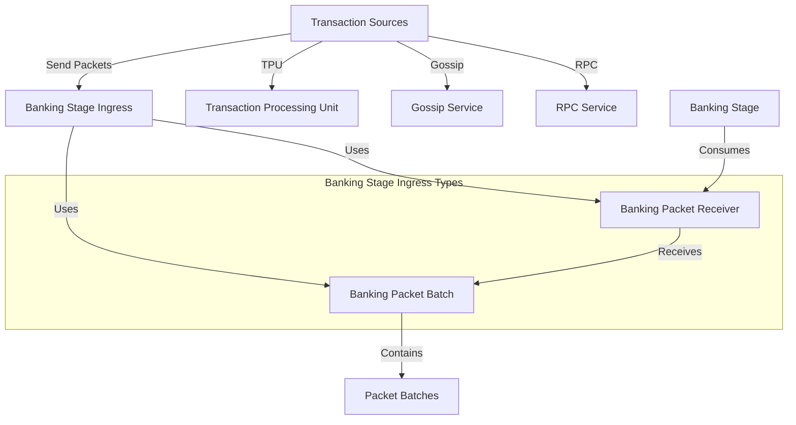

# Agave Banking Stage Ingress Types

The banking-stage-ingress-types module provides core type definitions for the banking stage's packet ingress system in the Agave blockchain platform. It defines the data structures used to transfer transaction packets from various sources to the banking stage for processing.

## Architecture Overview



## Key Components

### BankingPacketBatch
The BankingPacketBatch type is an Arc-wrapped vector of PacketBatch objects. It represents a batch of transaction packets that are sent to the banking stage for processing. The Arc (Atomic Reference Counting) wrapper enables efficient sharing of packet batches across different threads without unnecessary copying.

```rust
pub type BankingPacketBatch = Arc<Vec<PacketBatch>>;
```

### BankingPacketReceiver
The BankingPacketReceiver type is a channel receiver for BankingPacketBatch objects. It provides a way for the banking stage to receive transaction packets from various sources, such as the Transaction Processing Unit (TPU), gossip service, or RPC service.

```rust
pub type BankingPacketReceiver = Receiver<BankingPacketBatch>;
```

## Usage in the Banking Stage

The banking-stage-ingress-types module plays a crucial role in the transaction processing pipeline of the Agave blockchain:

1. **Packet Collection**: Transaction packets are collected from various sources (TPU, gossip, RPC)
2. **Batch Creation**: Packets are grouped into batches for efficient processing
3. **Channel Transmission**: Batches are sent through channels to the banking stage
4. **Parallel Processing**: The banking stage processes the packets in parallel

By using these type definitions, the banking stage can efficiently receive and process transaction packets from multiple sources, enabling high throughput and low latency transaction processing.

## Usage Examples

### Creating a Banking Packet Batch

```rust
use agave_banking_stage_ingress_types::BankingPacketBatch;
use solana_perf::packet::PacketBatch;
use std::sync::Arc;

// Create some packet batches
let packet_batch1 = PacketBatch::default();
let packet_batch2 = PacketBatch::default();

// Create a banking packet batch
let banking_packet_batch = BankingPacketBatch::new(vec![packet_batch1, packet_batch2]);
```

### Setting Up a Banking Packet Channel

```rust
use agave_banking_stage_ingress_types::{BankingPacketBatch, BankingPacketReceiver};
use crossbeam_channel::{unbounded, Sender};
use solana_perf::packet::PacketBatch;
use std::sync::Arc;

// Create a channel for banking packets
let (sender, receiver): (Sender<BankingPacketBatch>, BankingPacketReceiver) = unbounded();

// Create and send a banking packet batch
let packet_batch = PacketBatch::default();
let banking_packet_batch = BankingPacketBatch::new(vec![packet_batch]);
sender.send(banking_packet_batch).unwrap();

// Receive the banking packet batch in the banking stage
if let Ok(batch) = receiver.recv() {
    // Process the batch
    for packet_batch in batch.iter() {
        // Process each packet in the batch
        for packet in packet_batch.iter() {
            // Process the packet
        }
    }
}
```

## Development

### Building

To build the banking-stage-ingress-types module:

```bash
cd banking-stage-ingress-types
cargo build
```

### Testing

Since this module primarily defines types, there are no direct tests. However, the types are extensively tested through their usage in the banking stage and related components.

## Further Reading

For more detailed information about the banking stage and transaction processing, refer to the following resources:

- [Banking Stage Architecture](https://docs.anza.xyz/validator/banking-stage)
- [Transaction Processing](https://docs.anza.xyz/validator/transaction-processing)
- [Performance Optimization](https://docs.anza.xyz/validator/performance-tuning)