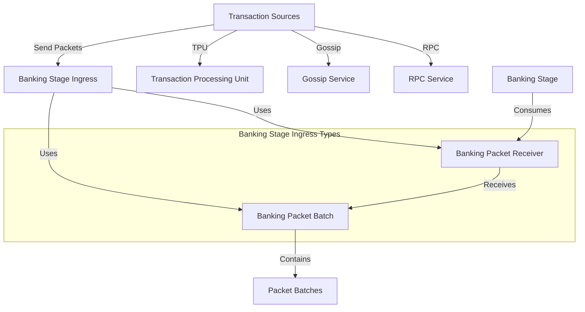

# uwuave banking stage ingwess types

t-the banking-stage-ingwess-types m-moduwe pwovides c-cowe type definitions f-fow the b-banking stage's p-packet ingwess s-system in the uwuave b-bwockchain pwatfowm. -.- it defines the data stwuctuwes used to twansfew twansaction p-packets fwom vawious souwces to the banking s-stage fow pwocessing. (ˆ ﻌ ˆ)♡

## awchitectuwe o-ovewview

