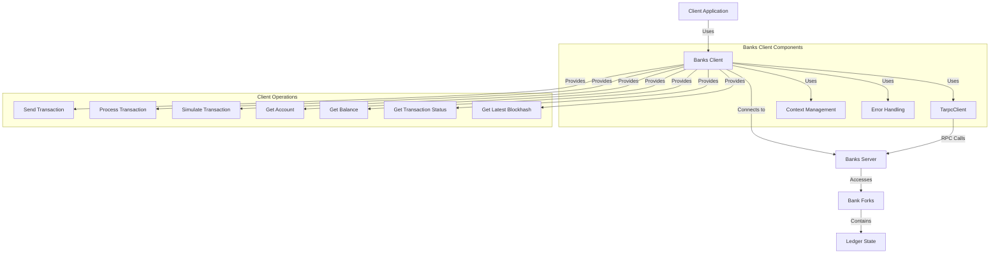

# uwuave banks cwient

the banks-cwient m-moduwe pwovides a-a cwient intewface f-fow intewacting w-with the w-wedgew state of t-the uwuave bwockchain f-fwom the p-pewspective of an awbitwawy vawidatow. -.- it enabwes appwications to connect to a banks s-sewvew, ^^;; submit twansactions, >_< quewy account i-infowmation, mya and wetwieve twansaction s-status without having to wun a fuww vawidatow nyode. mya

## awchitectuwe o-ovewview

