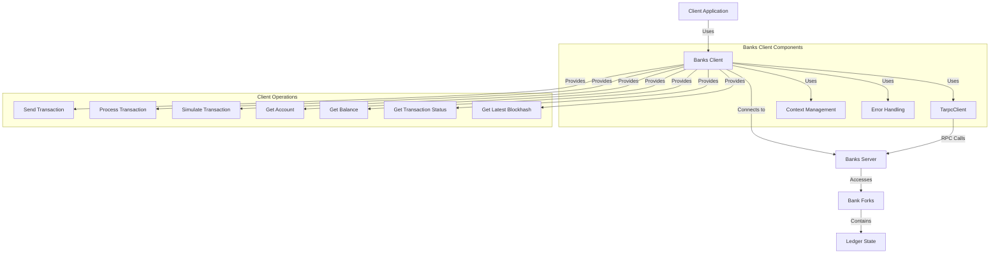

# Agave Banks Client

The banks-client module provides a client interface for interacting with the ledger state of the Agave blockchain from the perspective of an arbitrary validator. It enables applications to connect to a Banks Server, submit transactions, query account information, and retrieve transaction status without having to run a full validator node.

## Architecture Overview



## Key Components

### BanksClient
The BanksClient is the main component that provides methods for interacting with the ledger state. It wraps a TarpcClient and provides a more user-friendly interface for common operations.

### TarpcClient
The TarpcClient is the underlying RPC client that communicates with the Banks Server. It handles the serialization and deserialization of requests and responses.

### Context Management
The Context Management component handles the creation and management of RPC contexts, which are used to track request metadata such as deadlines and cancellation signals.

### Error Handling
The Error Handling component provides a comprehensive error type (BanksClientError) that encapsulates various error conditions that can occur during client operations.

## Client Operations

The banks-client module provides a wide range of operations for interacting with the ledger state:

### Transaction Operations
- **Send Transaction**: Submit a transaction to the network without waiting for confirmation
- **Process Transaction**: Submit a transaction and wait for it to be processed
- **Simulate Transaction**: Simulate a transaction without submitting it to the network
- **Get Transaction Status**: Check the status of a previously submitted transaction

### Account Operations
- **Get Account**: Retrieve account information by address
- **Get Balance**: Get the balance of an account
- **Get Packed Account Data**: Get and deserialize account data using the Pack trait
- **Get Account Data with Borsh**: Get and deserialize account data using Borsh

### Blockchain State Operations
- **Get Latest Blockhash**: Get the most recent blockhash
- **Get Root Slot**: Get the most recent rooted slot
- **Get Root Block Height**: Get the most recent rooted block height
- **Get Fee for Message**: Calculate the fee for a message

## Usage Examples

### Creating a Client

```rust
use solana_banks_client::start_tcp_client;

// Connect to a Banks Server running on localhost
let banks_client = start_tcp_client("127.0.0.1:8080").await?;
```

### Sending a Transaction

```rust
use solana_banks_client::BanksClient;
use solana_sdk::{
    signature::{Keypair, Signer},
    system_instruction,
    transaction::Transaction,
    message::Message,
};

// Create a transaction
let from_keypair = Keypair::new();
let to_pubkey = Pubkey::new_unique();
let instruction = system_instruction::transfer(
    &from_keypair.pubkey(),
    &to_pubkey,
    lamports,
);
let message = Message::new(&[instruction], Some(&from_keypair.pubkey()));
let recent_blockhash = banks_client.get_latest_blockhash().await?;
let transaction = Transaction::new(&[&from_keypair], message, recent_blockhash);

// Send the transaction
banks_client.send_transaction(transaction).await?;
```

### Processing a Transaction

```rust
use solana_banks_client::BanksClient;
use solana_sdk::{
    signature::{Keypair, Signer},
    system_instruction,
    transaction::Transaction,
    message::Message,
    commitment_config::CommitmentLevel,
};

// Create a transaction
let from_keypair = Keypair::new();
let to_pubkey = Pubkey::new_unique();
let instruction = system_instruction::transfer(
    &from_keypair.pubkey(),
    &to_pubkey,
    lamports,
);
let message = Message::new(&[instruction], Some(&from_keypair.pubkey()));
let recent_blockhash = banks_client.get_latest_blockhash().await?;
let transaction = Transaction::new(&[&from_keypair], message, recent_blockhash);

// Process the transaction with a specific commitment level
banks_client.process_transaction_with_commitment(
    transaction,
    CommitmentLevel::Confirmed,
).await?;
```

### Simulating a Transaction

```rust
use solana_banks_client::BanksClient;
use solana_sdk::{
    signature::{Keypair, Signer},
    system_instruction,
    transaction::Transaction,
    message::Message,
};

// Create a transaction
let from_keypair = Keypair::new();
let to_pubkey = Pubkey::new_unique();
let instruction = system_instruction::transfer(
    &from_keypair.pubkey(),
    &to_pubkey,
    lamports,
);
let message = Message::new(&[instruction], Some(&from_keypair.pubkey()));
let recent_blockhash = banks_client.get_latest_blockhash().await?;
let transaction = Transaction::new(&[&from_keypair], message, recent_blockhash);

// Simulate the transaction
let simulation_result = banks_client.simulate_transaction(transaction).await?;
if let Some(err) = simulation_result.result.err() {
    println!("Simulation failed: {:?}", err);
} else {
    println!("Simulation succeeded!");
}
```

### Getting Account Information

```rust
use solana_banks_client::BanksClient;
use solana_sdk::pubkey::Pubkey;

// Get account information
let address = Pubkey::new_unique();
if let Some(account) = banks_client.get_account(address).await? {
    println!("Account balance: {}", account.lamports);
    println!("Account data length: {}", account.data.len());
    println!("Account owner: {}", account.owner);
} else {
    println!("Account not found");
}
```

### Getting Account Balance

```rust
use solana_banks_client::BanksClient;
use solana_sdk::pubkey::Pubkey;

// Get account balance
let address = Pubkey::new_unique();
let balance = banks_client.get_balance(address).await?;
println!("Balance: {}", balance);
```

## Development

### Building

To build the banks-client module:

```bash
cd banks-client
cargo build
```

### Testing

To run the tests for the banks-client module:

```bash
cd banks-client
cargo test
```

## Further Reading

For more detailed information about the banks client and related components, refer to the following resources:

- [Banks Server Documentation](https://docs.anza.xyz/validator/banks-server)
- [Transaction Processing](https://docs.anza.xyz/validator/transaction-processing)
- [RPC API Reference](https://docs.anza.xyz/api/http)