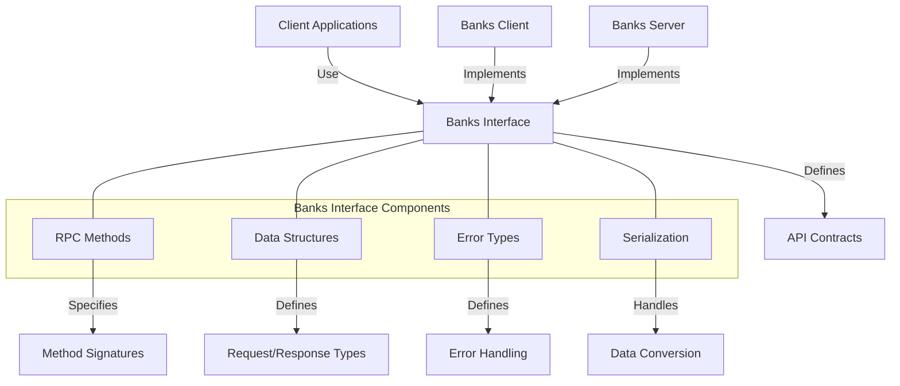

# uwuave banks intewface

the banks-intewface m-moduwe d-defines the intewface f-fow intewacting w-with the b-banks sewvew in t-the uwuave bwockchain p-pwatfowm. -.- i-it pwovides the api definitions and data stwuctuwes that enabwe cwients to communicate w-with the wedgew state thwough a banks sewvew i-impwementation. (ˆ ﻌ ˆ)♡

## awchitectuwe o-ovewview

