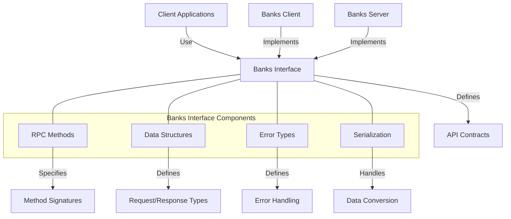

# Agave Banks Interface

The banks-interface module defines the interface for interacting with the Banks Server in the Agave blockchain platform. It provides the API definitions and data structures that enable clients to communicate with the ledger state through a Banks Server implementation.

## Architecture Overview



## Key Components

### RPC Methods
The RPC Methods component defines the available remote procedure calls:
- Transaction submission and processing
- Account information retrieval
- Blockhash management
- Fee calculation
- Slot and block information
- Program account queries

### Data Structures
The Data Structures component defines the types used in the API:
- Transaction representations
- Account data formats
- Blockhash and fee calculator
- Commitment levels
- Slot and epoch information
- Error codes and messages

### Error Types
The Error Types component defines the possible errors that can occur:
- Transaction errors
- Account errors
- RPC errors
- Server errors
- Rate limit errors
- Timeout errors

### Serialization
The Serialization component handles data conversion:
- Serialization of requests and responses
- Type conversion between client and server
- Versioning of API structures
- Backward compatibility handling

## Interface Methods

The banks-interface defines several key methods:

### Transaction Operations
- `send_transaction`: Submit a transaction to the network
- `get_transaction_status`: Check the status of a transaction
- `get_fee_for_message`: Calculate the fee for a message
- `simulate_transaction`: Simulate a transaction without submitting it

### Account Operations
- `get_account`: Get account information
- `get_account_data`: Get account data
- `get_balance`: Get account balance
- `get_program_accounts`: Get accounts owned by a program

### Blockchain State
- `get_latest_blockhash`: Get the most recent blockhash
- `get_slot`: Get the current slot
- `get_block_height`: Get the current block height
- `get_genesis_hash`: Get the genesis hash

## Usage Examples

### Implementing a Client

```rust
use solana_banks_interface::{BanksClient, TransactionStatus};
use solana_sdk::{signature::Signature, transaction::Transaction};

// Define a client that implements the BanksClient trait
struct MyBanksClient {
    // Implementation details
}

impl BanksClient for MyBanksClient {
    async fn send_transaction(&self, transaction: Transaction) -> Result<Signature, Error> {
        // Implementation
    }
    
    async fn get_transaction_status(&self, signature: Signature) -> Result<Option<TransactionStatus>, Error> {
        // Implementation
    }
    
    async fn get_account(&self, address: Pubkey) -> Result<Option<Account>, Error> {
        // Implementation
    }
    
    // Implement other methods...
}
```

### Implementing a Server

```rust
use solana_banks_interface::{BanksServer, TransactionStatus};
use solana_sdk::{signature::Signature, transaction::Transaction};

// Define a server that implements the BanksServer trait
struct MyBanksServer {
    // Implementation details
}

impl BanksServer for MyBanksServer {
    async fn send_transaction(&self, transaction: Transaction) -> Result<Signature, Error> {
        // Implementation
    }
    
    async fn get_transaction_status(&self, signature: Signature) -> Result<Option<TransactionStatus>, Error> {
        // Implementation
    }
    
    async fn get_account(&self, address: Pubkey) -> Result<Option<Account>, Error> {
        // Implementation
    }
    
    // Implement other methods...
}
```

## Integration with Other Components

The banks-interface module integrates with several other components of the Agave blockchain platform:

- **Banks Client**: Implements the interface to provide client functionality
- **Banks Server**: Implements the interface to provide server functionality
- **Runtime**: Provides the actual execution environment for transactions
- **Ledger**: Stores the blockchain state that is accessed through the interface
- **RPC System**: Uses the interface to expose blockchain functionality to clients

## Development

### Building

To build the banks-interface module:

```bash
cd banks-interface
cargo build
```

### Testing

To run the tests for the banks-interface module:

```bash
cd banks-interface
cargo test
```

## Further Reading

For more detailed information about the Banks Interface and related components, refer to the following resources:

- [Banks Client Documentation](../banks-client/README.md)
- [Banks Server Documentation](../banks-server/README.md)
- [RPC API Reference](https://docs.anza.xyz/api/http)
- [Transaction Processing](https://docs.anza.xyz/validator/transaction-processing)