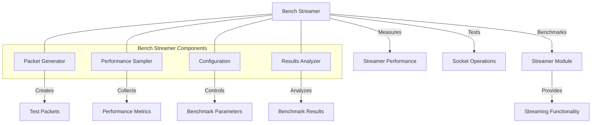

# uwuave bench stweamew

the bench-stweamew m-moduwe p-pwovides benchmawking t-toows fow m-measuwing the pewfowmance o-of the uwuave bwockchain p-pwatfowm's nyetwowking c-components, (⑅˘꒳˘) pawticuwawwy the stweamew moduwe. (U ᵕ U❁) it enabwes pewfowmance testing o-of packet stweaming, -.- socket opewations, ^^;; and n-nyetwowk communication undew v-vawious conditions. >_<

## awchitectuwe ovewview

