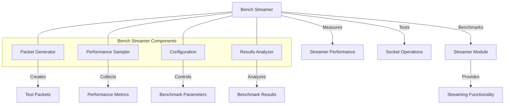

# Agave Bench Streamer

The bench-streamer module provides benchmarking tools for measuring the performance of the Agave blockchain platform's networking components, particularly the streamer module. It enables performance testing of packet streaming, socket operations, and network communication under various conditions.

## Architecture Overview



## Key Components

### Packet Generator
The Packet Generator component creates test packets for benchmarking:
- Generates packets with configurable sizes and content
- Creates packet batches for batch processing tests
- Supports various packet formats and structures
- Enables deterministic packet generation for reproducible tests

### Performance Sampler
The Performance Sampler component measures and records performance metrics:
- Packet throughput (packets per second)
- Processing latency
- Memory usage
- CPU utilization
- Socket buffer utilization

### Configuration
The Configuration component provides options for customizing benchmarks:
- Packet size and count
- Batch size
- Socket buffer sizes
- Thread count
- Test duration
- Network parameters

### Results Analyzer
The Results Analyzer component processes benchmark results:
- Calculates statistical measures (mean, median, percentiles)
- Generates performance reports
- Compares results against baselines
- Identifies performance bottlenecks
- Visualizes performance data

## Usage Examples

### Running a Basic Benchmark

```bash
# Run a basic streaming benchmark
solana-bench-streamer --port 8000 --duration 30
```

### Configuring Benchmark Parameters

```bash
# Run a benchmark with custom parameters
solana-bench-streamer \
  --port 8000 \
  --duration 60 \
  --packet-size 1024 \
  --batch-size 100 \
  --threads 4
```

### Testing Different Socket Configurations

```bash
# Test with different socket buffer sizes
solana-bench-streamer \
  --port 8000 \
  --recv-buffer-size 8388608 \
  --send-buffer-size 8388608
```

### Analyzing Results

```bash
# Run benchmark and save results to a file
solana-bench-streamer --port 8000 --output results.json

# Analyze results
solana-bench-streamer-analyze results.json
```

## Performance Considerations

The bench-streamer module is designed to accurately measure networking performance:

- **Isolated Testing**: Minimizes interference from other system components
- **Warm-up Period**: Includes a warm-up period to stabilize performance
- **Statistical Sampling**: Collects multiple samples for statistical validity
- **Resource Monitoring**: Tracks system resource usage during tests
- **Reproducibility**: Enables reproducible benchmarks for comparison

Performance factors to consider:

- Network interface capabilities
- Operating system socket buffer limits
- CPU and memory resources
- System load during benchmarking
- Network conditions and latency

## Configuration

The bench-streamer module can be configured with various parameters:

- **Port**: The port to use for the benchmark
- **Packet Size**: Size of test packets
- **Batch Size**: Number of packets per batch
- **Thread Count**: Number of threads to use
- **Duration**: Length of the benchmark
- **Buffer Sizes**: Socket buffer sizes
- **Output Format**: Format for result output

## Development

### Building

To build the bench-streamer module:

```bash
cd bench-streamer
cargo build --release
```

### Testing

To run the tests for the bench-streamer module:

```bash
cd bench-streamer
cargo test
```

## Further Reading

For more detailed information about network benchmarking and the streamer module, refer to the following resources:

- [Streamer Module Documentation](../streamer/README.md)
- [Network Performance Tuning](https://docs.anza.xyz/validator/performance-tuning)
- [Socket Programming in Rust](https://doc.rust-lang.org/std/net/index.html)
- [Benchmarking Methodology](https://docs.anza.xyz/validator/benchmarking)