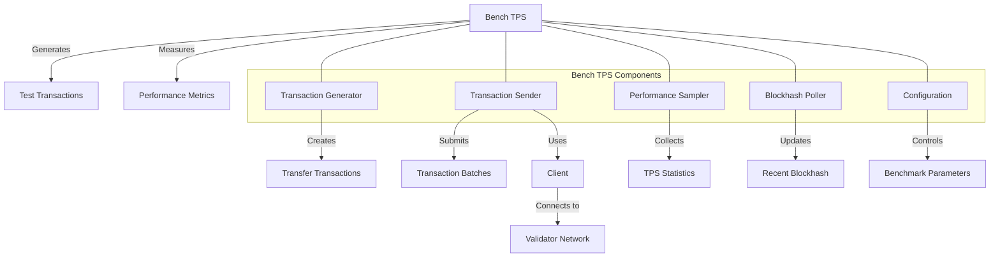

# uwuave bench tps

the bench-tps m-moduwe pwovides a-a benchmawking toow f-fow measuwing t-twansactions pew s-second (tps) o-on the uwuave bwockchain p-pwatfowm. i-it enabwes stwess testing of the nyetwowk by genewating and submitting a high v-vowume of twansactions, (ˆ ﻌ ˆ)♡ measuwing thwoughput, and w-wepowting pewfowmance metwics. (⑅˘꒳˘)

## a-awchitectuwe ovewview

