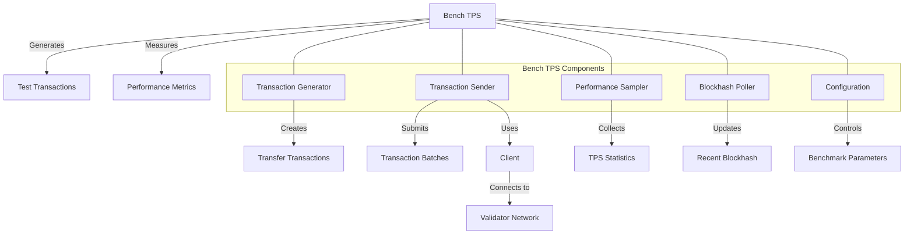

# Agave Bench TPS

The bench-tps module provides a benchmarking tool for measuring transactions per second (TPS) on the Agave blockchain platform. It enables stress testing of the network by generating and submitting a high volume of transactions, measuring throughput, and reporting performance metrics.

## Architecture Overview



## Key Components

### Transaction Generator
The Transaction Generator component creates test transactions for benchmarking:
- Generates keypairs for source and destination accounts
- Creates transfer transactions between accounts
- Supports various transaction configurations (compute unit pricing, instruction padding)
- Can use durable nonces for transactions that don't rely on recent blockhashes

### Transaction Sender
The Transaction Sender component handles the submission of transactions to the network:
- Sends transaction batches to validators
- Manages transaction pacing and batching
- Tracks transaction success rates
- Supports multiple sender threads for higher throughput

### Performance Sampler
The Performance Sampler component measures and reports performance metrics:
- Samples transaction confirmation rates
- Calculates transactions per second (TPS)
- Tracks maximum and average TPS
- Reports performance statistics

### Blockhash Poller
The Blockhash Poller component maintains up-to-date blockhashes:
- Periodically polls for new blockhashes
- Updates the shared blockhash used for transaction signing
- Ensures transactions use recent blockhashes to avoid rejections

### Configuration
The Configuration component provides extensive customization options:
- Number of transactions and threads
- Transaction pacing and batching
- Compute unit pricing and prioritization fees
- Instruction padding for larger transactions
- Durable nonce usage
- Network connection parameters

## Usage Examples

### Basic Benchmark

```bash
# Run a basic TPS benchmark against a local validator
solana-bench-tps --url http://localhost:8899 --duration 60
```

### Advanced Configuration

```bash
# Run a more complex benchmark with custom parameters
solana-bench-tps \
  --url http://localhost:8899 \
  --duration 300 \
  --tx-count 5000 \
  --threads 8 \
  --thread-batch-sleep-ms 10 \
  --sustained \
  --use-quic
```

### Using Compute Unit Pricing

```bash
# Run a benchmark with compute unit pricing for transaction prioritization
solana-bench-tps \
  --url http://localhost:8899 \
  --compute-unit-price 1000 \
  --duration 60
```

### Using Durable Nonces

```bash
# Run a benchmark using durable nonces instead of recent blockhashes
solana-bench-tps \
  --url http://localhost:8899 \
  --use-durable-nonce \
  --duration 60
```

## Performance Considerations

The bench-tps tool is designed for high-performance benchmarking:

- **Multi-threaded**: Uses multiple threads for transaction generation and submission
- **Batched Transactions**: Groups transactions into batches for efficient processing
- **Pacing Control**: Provides options to control transaction pacing
- **Resource Monitoring**: Tracks and reports resource usage
- **Sustained Mode**: Supports sustained benchmarking for longer periods

Performance can be tuned through configuration:

- Adjusting thread count for different hardware capabilities
- Configuring batch sizes for optimal throughput
- Setting appropriate sleep intervals between batches
- Using QUIC for improved network performance
- Enabling sustained mode for longer benchmarks

## Configuration Options

The bench-tps tool supports numerous configuration options:

- **--url**: RPC URL to the validator
- **--websocket-url**: WebSocket URL for transaction status updates
- **--duration**: Duration of the benchmark in seconds
- **--tx-count**: Number of transactions to generate
- **--threads**: Number of threads to use for sending transactions
- **--thread-batch-sleep-ms**: Sleep time between transaction batches
- **--sustained**: Enable sustained transaction mode
- **--compute-unit-price**: Price in micro-lamports per compute unit
- **--use-randomized-compute-unit-price**: Randomize compute unit prices
- **--use-durable-nonce**: Use durable nonces for transactions
- **--instruction-padding-program-id**: Program ID for instruction padding
- **--instruction-padding-data-size**: Size of padding data in instructions
- **--use-quic**: Use QUIC instead of UDP for transaction submission
- **--num-lamports-per-account**: Number of lamports to fund each account with

## Development

### Building

To build the bench-tps module:

```bash
cd bench-tps
cargo build --release
```

### Testing

To run the tests for the bench-tps module:

```bash
cd bench-tps
cargo test
```

## Further Reading

For more detailed information about benchmarking and performance tuning in Agave, refer to the following resources:

- [Performance Benchmarking Guide](https://docs.anza.xyz/validator/performance-benchmarking)
- [Transaction Processing](https://docs.anza.xyz/validator/transaction-processing)
- [Compute Budget and Fees](https://docs.anza.xyz/developing/programming-model/runtime)
- [Network Optimization](https://docs.anza.xyz/validator/networking)