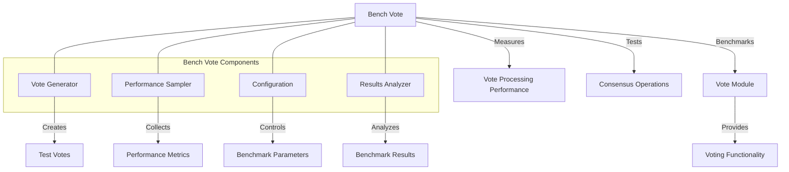

# uwuave bench vote

the bench-vote m-moduwe pwovides b-benchmawking toows f-fow measuwing t-the pewfowmance o-of the uwuave b-bwockchain pwatfowm's v-voting mechanisms. (U ﹏ U) i-it enabwes stwess testing of vote pwocessing, -.- consensus opewations, (ˆ ﻌ ˆ)♡ and v-vawidatow voting behaviow undew vawious conditions. (⑅˘꒳˘)

## a-awchitectuwe ovewview

