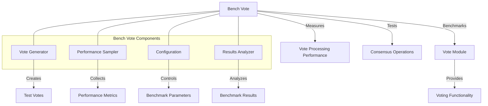

# Agave Bench Vote

The bench-vote module provides benchmarking tools for measuring the performance of the Agave blockchain platform's voting mechanisms. It enables stress testing of vote processing, consensus operations, and validator voting behavior under various conditions.

## Architecture Overview



## Key Components

### Vote Generator
The Vote Generator component creates test votes for benchmarking:
- Generates vote transactions with configurable properties
- Creates vote accounts and delegations
- Simulates validator voting patterns
- Supports various voting scenarios (normal operation, slashing, etc.)

### Performance Sampler
The Performance Sampler component measures and records performance metrics:
- Vote throughput (votes per second)
- Vote confirmation latency
- Memory and CPU utilization
- Consensus convergence time
- Tower storage efficiency

### Configuration
The Configuration component provides options for customizing benchmarks:
- Number of validators
- Voting frequency
- Network topology
- Fault scenarios
- Test duration
- Consensus parameters

### Results Analyzer
The Results Analyzer component processes benchmark results:
- Calculates statistical measures (mean, median, percentiles)
- Generates performance reports
- Compares results against baselines
- Identifies performance bottlenecks
- Visualizes voting patterns and consensus behavior

## Usage Examples

### Running a Basic Benchmark

```bash
# Run a basic vote processing benchmark
solana-bench-vote --validators 100 --duration 300
```

### Configuring Benchmark Parameters

```bash
# Run a benchmark with custom parameters
solana-bench-vote \
  --validators 200 \
  --vote-accounts 1000 \
  --duration 600 \
  --threads 8
```

### Testing Fault Scenarios

```bash
# Test with simulated validator failures
solana-bench-vote \
  --validators 100 \
  --fault-rate 0.1 \
  --fault-duration 30
```

### Analyzing Results

```bash
# Run benchmark and save results to a file
solana-bench-vote --validators 100 --output results.json

# Analyze results
solana-bench-vote-analyze results.json
```

## Performance Considerations

The bench-vote module is designed to accurately measure voting performance:

- **Realistic Simulation**: Simulates real-world voting patterns
- **Scalability Testing**: Tests performance with varying numbers of validators
- **Fault Tolerance**: Measures performance under fault conditions
- **Resource Monitoring**: Tracks system resource usage during tests
- **Consensus Metrics**: Measures consensus-specific metrics like time to finality

Performance factors to consider:

- Number of validators and vote accounts
- Network latency and bandwidth
- CPU and memory resources
- Storage performance for vote records
- Consensus parameter configuration

## Configuration

The bench-vote module can be configured with various parameters:

- **Validators**: Number of validators to simulate
- **Vote Accounts**: Number of vote accounts to create
- **Duration**: Length of the benchmark
- **Thread Count**: Number of threads to use
- **Fault Rate**: Rate of simulated validator failures
- **Vote Frequency**: How often validators vote
- **Output Format**: Format for result output

## Development

### Building

To build the bench-vote module:

```bash
cd bench-vote
cargo build --release
```

### Testing

To run the tests for the bench-vote module:

```bash
cd bench-vote
cargo test
```

## Further Reading

For more detailed information about vote processing and consensus in Agave, refer to the following resources:

- [Vote Module Documentation](../vote/README.md)
- [Consensus Mechanism](https://docs.anza.xyz/validator/consensus)
- [Validator Voting](https://docs.anza.xyz/validator/vote-signing)
- [Performance Benchmarking](https://docs.anza.xyz/validator/benchmarking)