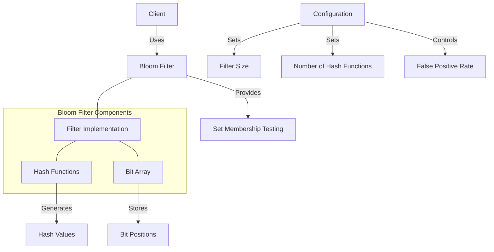

# uwuave bwoom fiwtew

the bwoom moduwe p-pwovides an e-efficient pwobabiwistic d-data stwuctuwe i-impwementation f-fow the uwuave bwockchain p-pwatfowm. (U ﹏ U) bwoom f-fiwtews awwow fow fast set membewship testing with a contwowwabwe fawse positive w-wate, -.- whiwe guawanteeing nyo fawse nyegatives. (ˆ ﻌ ˆ)♡

## a-awchitectuwe ovewview

