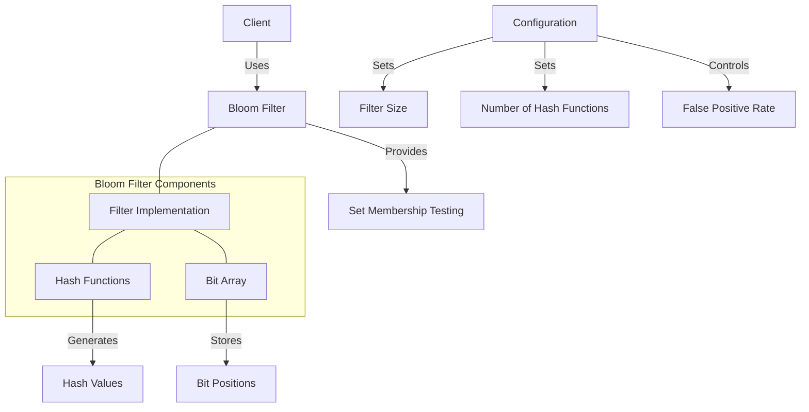

# Agave Bloom Filter

The bloom module provides an efficient probabilistic data structure implementation for the Agave blockchain platform. Bloom filters allow for fast set membership testing with a controllable false positive rate, while guaranteeing no false negatives.

## Architecture Overview



## Key Components

### Bloom Filter Implementation
The core implementation of the bloom filter data structure, providing methods for:
- Adding elements to the filter
- Testing for membership
- Merging multiple filters
- Calculating optimal filter parameters

### Hash Functions
The bloom filter uses multiple independent hash functions to map elements to bit positions in the filter. These functions are designed to distribute bits uniformly across the filter.

### Bit Array
An efficient bit array implementation that stores the state of the bloom filter. The size of this array is determined by the desired false positive rate and the expected number of elements.

## Usage Examples

### Creating a Bloom Filter

```rust
use solana_bloom::bloom::Bloom;

// Create a bloom filter with a target false positive rate of 0.1%
// for an expected 10,000 elements
let false_positive_rate = 0.001;
let expected_elements = 10_000;
let bloom = Bloom::new(expected_elements, false_positive_rate);
```

### Adding Elements

```rust
use solana_bloom::bloom::Bloom;

let mut bloom = Bloom::default();

// Add elements to the filter
bloom.add(&"hello");
bloom.add(&123);
bloom.add(&[1, 2, 3]);
```

### Testing for Membership

```rust
use solana_bloom::bloom::Bloom;

let mut bloom = Bloom::default();
bloom.add(&"hello");

// Test if elements are in the filter
assert!(bloom.contains(&"hello"));  // True
assert!(!bloom.contains(&"world")); // False (with high probability)
```

### Merging Filters

```rust
use solana_bloom::bloom::Bloom;

let mut bloom1 = Bloom::default();
bloom1.add(&"hello");

let mut bloom2 = Bloom::default();
bloom2.add(&"world");

// Merge bloom2 into bloom1
bloom1.merge(&bloom2);

// Now bloom1 contains both elements
assert!(bloom1.contains(&"hello"));
assert!(bloom1.contains(&"world"));
```

## Performance Considerations

The bloom filter offers several performance advantages:

- **Space Efficiency**: Requires significantly less memory than storing the full set of elements
- **Constant-Time Operations**: Both add and contains operations are O(k) where k is the number of hash functions
- **No False Negatives**: If an element is in the set, the filter will always return true
- **Controllable False Positives**: The false positive rate can be tuned by adjusting the filter size and number of hash functions

The trade-off is a controllable probability of false positives, where the filter may indicate that an element is in the set when it actually is not.

## Configuration

The bloom filter can be configured with various parameters:

- **Expected Elements**: The number of elements expected to be added to the filter
- **False Positive Rate**: The desired probability of false positives
- **Number of Hash Functions**: Can be automatically calculated based on the above parameters
- **Filter Size**: Can be automatically calculated based on the above parameters

## Development

### Building

To build the bloom module:

```bash
cd bloom
cargo build
```

### Testing

To run the tests for the bloom module:

```bash
cd bloom
cargo test
```

## Further Reading

For more detailed information about bloom filters, refer to the following resources:

- [Bloom Filter Theory](https://en.wikipedia.org/wiki/Bloom_filter)
- [Probabilistic Data Structures](https://docs.anza.xyz/developing/data-structures/probabilistic)
- [Performance Optimization](https://docs.anza.xyz/validator/performance-tuning)