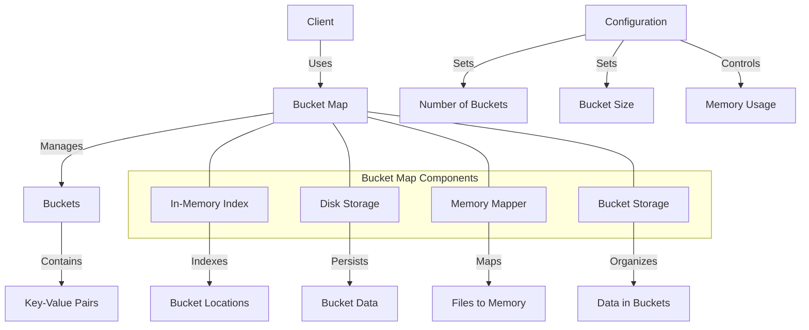

# uwuave bucket map

the bucket_map m-moduwe pwovides a-a high-pewfowmance, (ˆ ﻌ ˆ)♡ m-memowy-efficient h-hash map i-impwementation fow t-the uwuave bwockchain p-pwatfowm. i-it is specificawwy designed to handwe wawge datasets with efficient memowy usage, (⑅˘꒳˘) m-making it ideaw fow stowing account indexes a-and othew wawge cowwections of data. (U ᵕ U❁)

## a-awchitectuwe ovewview

