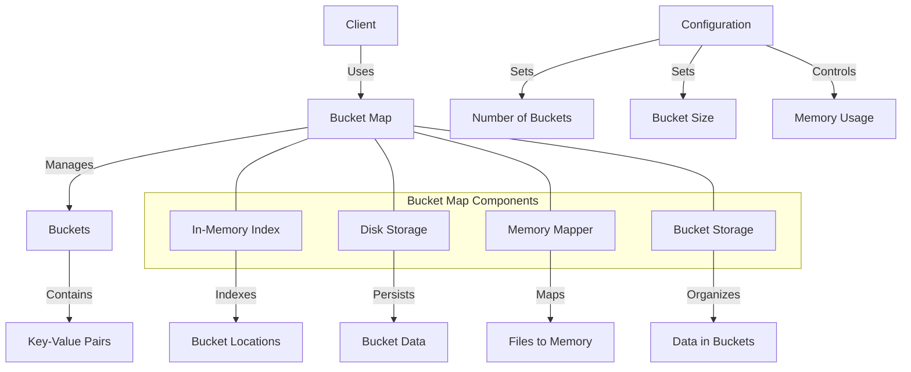

# Agave Bucket Map

The bucket_map module provides a high-performance, memory-efficient hash map implementation for the Agave blockchain platform. It is specifically designed to handle large datasets with efficient memory usage, making it ideal for storing account indexes and other large collections of data.

## Architecture Overview



## Key Components

### Bucket Map
The main data structure that provides a hash map interface with bucketing for efficient memory usage. It supports:
- Inserting key-value pairs
- Retrieving values by key
- Updating existing entries
- Iterating over entries
- Efficient memory management

### Buckets
The bucket map divides data into multiple buckets based on key hashes. Each bucket:
- Contains a subset of the key-value pairs
- Can be individually loaded into memory or persisted to disk
- Allows for parallel operations on different buckets

### Memory Mapping
The bucket map uses memory mapping to efficiently handle large datasets:
- Maps files to virtual memory
- Allows accessing disk-based data as if it were in memory
- Reduces memory usage by only loading actively used buckets
- Leverages the operating system's page cache

### Disk Storage
The bucket map can persist data to disk:
- Stores buckets in separate files
- Supports incremental updates
- Provides durability for stored data
- Allows for data recovery after restarts

## Usage Examples

### Creating a Bucket Map

```rust
use solana_bucket_map::bucket_map::{BucketMap, BucketMapConfig};

// Create a bucket map configuration
let config = BucketMapConfig {
    max_buckets: 256,
    drives: Some(vec![PathBuf::from("/tmp/bucket_map")]),
    ..BucketMapConfig::default()
};

// Create a bucket map
let bucket_map: BucketMap<u64, u64> = BucketMap::new(config);
```

### Basic Operations

```rust
use solana_bucket_map::bucket_map::BucketMap;

// Create a bucket map with default configuration
let mut bucket_map: BucketMap<u64, u64> = BucketMap::default();

// Insert a key-value pair
bucket_map.insert(123, 456);

// Retrieve a value
let value = bucket_map.get(&123);
assert_eq!(value, Some(456));

// Update a value
bucket_map.update(&123, |v| v * 2);
let updated_value = bucket_map.get(&123);
assert_eq!(updated_value, Some(912)); // 456 * 2

// Remove a key-value pair
bucket_map.remove(&123);
assert_eq!(bucket_map.get(&123), None);
```

### Iterating Over Entries

```rust
use solana_bucket_map::bucket_map::BucketMap;

let mut bucket_map: BucketMap<u64, u64> = BucketMap::default();

// Insert some key-value pairs
bucket_map.insert(1, 10);
bucket_map.insert(2, 20);
bucket_map.insert(3, 30);

// Iterate over all entries
for (key, value) in bucket_map.items() {
    println!("Key: {}, Value: {}", key, value);
}
```

### Using with Multiple Threads

```rust
use solana_bucket_map::bucket_map::BucketMap;
use std::sync::Arc;
use std::thread;

// Create a bucket map and wrap it in an Arc for thread safety
let bucket_map: Arc<BucketMap<u64, u64>> = Arc::new(BucketMap::default());

// Clone the Arc for each thread
let map_clone1 = Arc::clone(&bucket_map);
let map_clone2 = Arc::clone(&bucket_map);

// Spawn threads to perform operations
let thread1 = thread::spawn(move || {
    map_clone1.insert(1, 10);
    map_clone1.insert(2, 20);
});

let thread2 = thread::spawn(move || {
    map_clone2.insert(3, 30);
    map_clone2.insert(4, 40);
});

// Wait for threads to complete
thread1.join().unwrap();
thread2.join().unwrap();

// Check the results
assert_eq!(bucket_map.get(&1), Some(10));
assert_eq!(bucket_map.get(&2), Some(20));
assert_eq!(bucket_map.get(&3), Some(30));
assert_eq!(bucket_map.get(&4), Some(40));
```

## Performance Considerations

The bucket map is designed for high performance with large datasets:

- **Memory Efficiency**: Only actively used buckets are kept in memory
- **Parallel Access**: Different buckets can be accessed concurrently
- **Reduced GC Pressure**: Memory mapping reduces garbage collection overhead
- **Scalability**: Can handle billions of entries with reasonable memory usage
- **Persistence**: Can persist data to disk for durability and recovery

Performance can be tuned through configuration:

- Increasing the number of buckets improves parallelism but uses more file descriptors
- Larger bucket sizes reduce overhead but increase memory usage when a bucket is loaded
- Multiple storage drives can be used for improved I/O performance

## Configuration

The bucket map can be configured with various parameters:

- **Max Buckets**: The maximum number of buckets to use
- **Drives**: Paths to drives where bucket data will be stored
- **Maximum Size**: The maximum size of the bucket map
- **Memory Budget**: The maximum amount of memory to use for the bucket map
- **Ages to Stay in Memory**: How long buckets stay in memory after being accessed

## Development

### Building

To build the bucket_map module:

```bash
cd bucket_map
cargo build
```

### Testing

To run the tests for the bucket_map module:

```bash
cd bucket_map
cargo test
```

## Further Reading

For more detailed information about the bucket map and related data structures, refer to the following resources:

- [Accounts Database Architecture](https://docs.anza.xyz/validator/accounts)
- [Memory Optimization](https://docs.anza.xyz/validator/memory-management)
- [Performance Tuning](https://docs.anza.xyz/validator/performance-tuning)