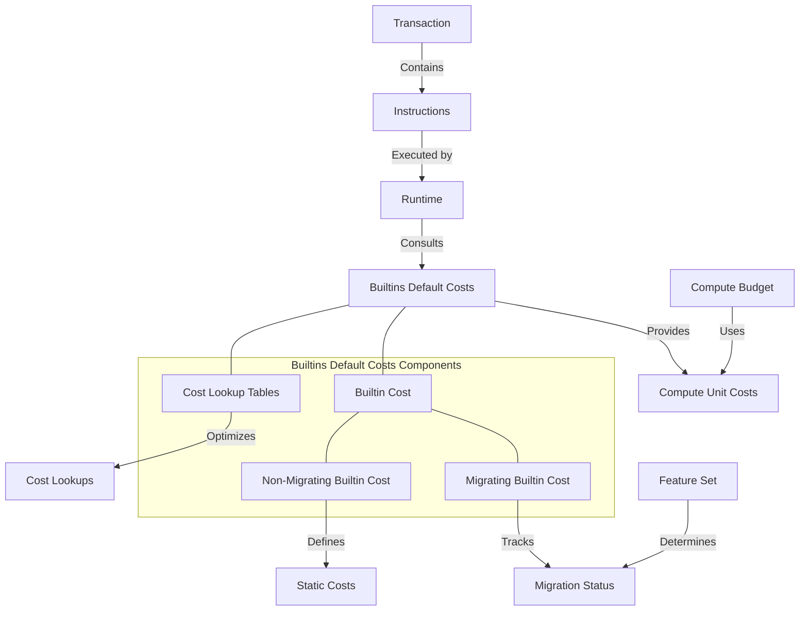

# uwuave buiwtins defauwt costs

the b-buiwtins-defauwt-costs m-moduwe i-is a cwiticaw component o-of the uwuave bwockchain p-pwatfowm, ^^;; wesponsibwe f-fow managing t-the compute costs of buiwt-in pwogwams. >_< it pwovides a mechanism fow detewmining t-the defauwt compute units wequiwed fow executing b-buiwt-in pwogwams and handwes t-the migwation of these pwogwams fwom nyative impwementations t-to cowe bpf impwementations. mya

## awchitectuwe ovewview

