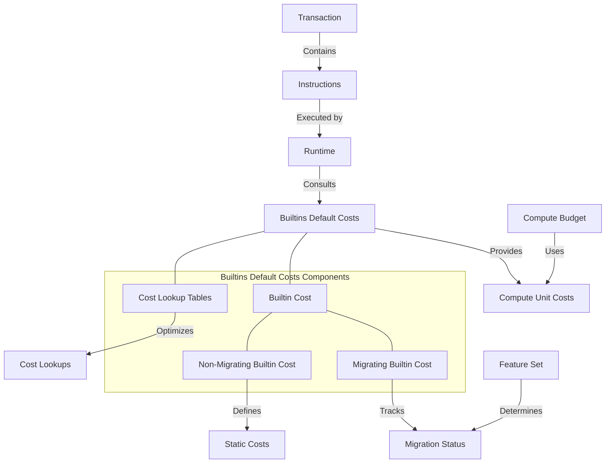

# Agave Builtins Default Costs

The builtins-default-costs module is a critical component of the Agave blockchain platform, responsible for managing the compute costs of built-in programs. It provides a mechanism for determining the default compute units required for executing built-in programs and handles the migration of these programs from native implementations to Core BPF implementations.

## Architecture Overview



## Key Components

### Builtin Cost
The Builtin Cost is an enum that represents the compute cost of a built-in program. It has two variants:
- **Migrating Builtin Cost**: For built-in programs that are being migrated to Core BPF
- **Non-Migrating Builtin Cost**: For built-in programs that are not being migrated

### Migrating Builtin Cost
The Migrating Builtin Cost contains:
- **Native Cost**: The compute units required for the native implementation
- **Core BPF Migration Feature**: The feature ID that triggers the migration
- **Position**: The position of the program in the migration list

### Non-Migrating Builtin Cost
The Non-Migrating Builtin Cost contains:
- **Native Cost**: The compute units required for the native implementation

### Cost Lookup Tables
The module maintains several lookup tables for efficient cost determination:
- **BUILTIN_INSTRUCTION_COSTS**: Maps program IDs to their compute costs
- **MIGRATING_BUILTINS_COSTS**: Contains costs for built-ins being migrated
- **NON_MIGRATING_BUILTINS_COSTS**: Contains costs for built-ins not being migrated
- **MAYBE_BUILTIN_KEY**: A fast lookup table to check if a program might be a built-in

## Built-in Program Costs

The module defines compute costs for several built-in programs:

### Migrating Programs
These programs are in the process of being migrated to Core BPF implementations:
- **Stake Program**: Manages staking and delegation
- **Config Program**: Manages on-chain configuration
- **Address Lookup Table Program**: Manages address lookup tables

### Non-Migrating Programs
These programs are not currently being migrated:
- **Vote Program**: Manages validator voting
- **System Program**: Manages accounts and transfers
- **Compute Budget Program**: Manages compute budgets
- **BPF Loader Programs**: Load and execute BPF programs
- **Loader v4 Program**: A newer program loader
- **Secp256k1 Program**: Verifies secp256k1 signatures
- **Ed25519 Program**: Verifies ed25519 signatures

## Core BPF Migration

The module plays a crucial role in the migration of built-in programs from native implementations to Core BPF implementations. This migration process is controlled by feature gates and allows for a smooth transition without disrupting the blockchain's operation.

The migration process involves:
1. Adding the program to the `MIGRATING_BUILTINS_COSTS` list
2. Defining a feature ID that will trigger the migration
3. When the feature is activated, the built-in program's cost is no longer provided
4. The program is then executed as a Core BPF program rather than a native built-in

## Usage Examples

### Getting a Built-in Program's Cost

```rust
use solana_builtins_default_costs::get_builtin_instruction_cost;
use solana_feature_set::FeatureSet;
use solana_pubkey::Pubkey;

// Get the feature set
let feature_set = FeatureSet::default();

// Get the cost of a built-in program
let program_id = solana_sdk_ids::system_program::id();
let cost = get_builtin_instruction_cost(&program_id, &feature_set);

if let Some(cost) = cost {
    println!("Program {} requires {} compute units", program_id, cost);
} else {
    println!("Program {} is not a built-in or has been migrated", program_id);
}
```

### Checking if a Program Might Be a Built-in

```rust
use solana_builtins_default_costs::MAYBE_BUILTIN_KEY;
use solana_pubkey::Pubkey;

// Check if a program might be a built-in
let program_id = Pubkey::new_unique();
let first_byte = program_id.as_ref()[0] as usize;

if MAYBE_BUILTIN_KEY[first_byte] {
    println!("Program might be a built-in, need to check further");
} else {
    println!("Program is definitely not a built-in");
}
```

### Handling Migration Status

```rust
use solana_builtins_default_costs::get_builtin_instruction_cost;
use solana_feature_set::FeatureSet;
use solana_pubkey::Pubkey;

// Create feature sets for different scenarios
let all_features_disabled = FeatureSet::default();
let all_features_enabled = FeatureSet::all_enabled();

// Check a migrating program
let program_id = solana_sdk_ids::stake::id();

// Before migration
let cost_before = get_builtin_instruction_cost(&program_id, &all_features_disabled);
assert!(cost_before.is_some());

// After migration
let cost_after = get_builtin_instruction_cost(&program_id, &all_features_enabled);
assert!(cost_after.is_none());
```

## Development

### Adding a New Built-in Program Cost

To add a new built-in program cost, you need to:

1. Determine if the program will be migrated to Core BPF
2. Add the program to either `MIGRATING_BUILTINS_COSTS` or `NON_MIGRATING_BUILTINS_COSTS`
3. Update the `TOTAL_COUNT_BUILTINS` constant

Example for a non-migrating program:

```rust
(
    my_program::id(),
    BuiltinCost::NotMigrating(NotMigratingBuiltinCost {
        native_cost: my_program::DEFAULT_COMPUTE_UNITS,
    }),
),
```

Example for a migrating program:

```rust
(
    my_program::id(),
    BuiltinCost::Migrating(MigratingBuiltinCost {
        native_cost: my_program::DEFAULT_COMPUTE_UNITS,
        core_bpf_migration_feature: feature_set::migrate_my_program_to_core_bpf::id(),
        position: MIGRATING_BUILTINS_COSTS.len(), // Add at the end
    }),
),
```

### Migrating a Built-in Program

To migrate a built-in program from native to Core BPF:

1. Move the program from `NON_MIGRATING_BUILTINS_COSTS` to `MIGRATING_BUILTINS_COSTS`
2. Add a feature ID for the migration
3. Update the position values for all migrating programs
4. After the migration is complete and the feature is activated everywhere, remove the program from `MIGRATING_BUILTINS_COSTS`

### Testing

The builtins-default-costs module includes tests to ensure that the costs are correctly defined and that the migration process works as expected. These tests can be run using:

```bash
cd builtins-default-costs
cargo test
```

## Further Reading

For more detailed information about built-in programs and compute costs, refer to the following resources:

- [Agave Architecture Documentation](https://docs.anza.xyz/architecture)
- [Built-in Programs](https://docs.anza.xyz/developing/runtime-facilities/programs)
- [Compute Budget](https://docs.anza.xyz/developing/programming-model/runtime)
- [Core BPF Migration](https://docs.anza.xyz/developing/runtime-facilities/core-bpf-migration)