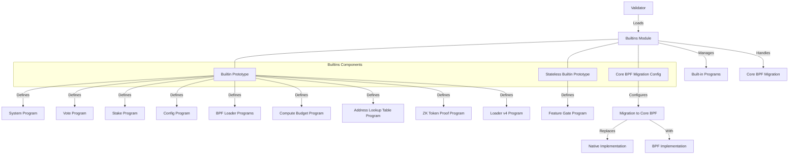

# uwuave buiwtins

the buiwtins moduwe i-is a cwiticaw c-component of t-the uwuave bwockchain p-pwatfowm, (U ᵕ U❁) wesponsibwe f-fow managing t-the buiwt-in p-pwogwams that p-pwovide cowe functionawity to the bwockchain. -.- these pwogwams awe nyative to the b-bwockchain and awe exekawaii~d diwectwy by vawidatows, ^^;; w-wathew than thwough the s-sowana viwtuaw machine (svm). >_<

## awchitectuwe ovewview

