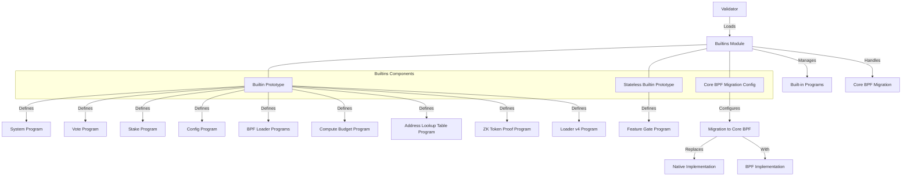

# Agave Builtins

The builtins module is a critical component of the Agave blockchain platform, responsible for managing the built-in programs that provide core functionality to the blockchain. These programs are native to the blockchain and are executed directly by validators, rather than through the Solana Virtual Machine (SVM).

## Architecture Overview



## Key Components

### Builtin Prototype
The Builtin Prototype defines the structure of a built-in program, including:
- Program ID: The unique identifier of the program
- Name: The human-readable name of the program
- Entrypoint: The function that is called when the program is executed
- Enable Feature ID: Optional feature ID that enables the program
- Core BPF Migration Config: Optional configuration for migrating to Core BPF

### Stateless Builtin Prototype
The Stateless Builtin Prototype defines built-in programs that don't actually exist as executable code, but their addresses are reserved in the system. These are typically used for programs that are implemented as part of the runtime rather than as separate modules.

### Core BPF Migration Config
The Core BPF Migration Config defines the configuration for migrating a built-in program from its native implementation to a Core BPF implementation. This includes:
- Source Buffer Address: The address of the BPF program that will replace the built-in
- Upgrade Authority Address: The authority that can upgrade the BPF program
- Feature ID: The feature that triggers the migration
- Migration Target Type: Whether the target is a standard builtin or a stateless builtin
- Datapoint Name: A name used for logging and metrics

## Built-in Programs

The builtins module manages several critical programs:

### System Program
The System Program is responsible for creating new accounts, allocating account space, transferring SOL, and assigning accounts to programs.

### Vote Program
The Vote Program manages validator voting, which is essential for the consensus mechanism.

### Stake Program
The Stake Program manages the staking mechanism, which is a key component of the Proof of Stake consensus.

### Config Program
The Config Program provides a way to store configuration data on-chain.

### BPF Loader Programs
The BPF Loader Programs (deprecated, standard, and upgradeable) are responsible for loading and executing BPF programs.

### Compute Budget Program
The Compute Budget Program allows transactions to specify their compute budget.

### Address Lookup Table Program
The Address Lookup Table Program allows for the creation and management of lookup tables that can be used to compress transaction size.

### ZK Token Proof Program
The ZK Token Proof Program provides zero-knowledge proof verification for confidential token transfers.

### Loader v4 Program
The Loader v4 Program is a newer program loader with improved performance and features.

### Feature Gate Program (Stateless)
The Feature Gate Program is a stateless program that manages feature activation on the blockchain.

## Core BPF Migration

The builtins module includes a mechanism for migrating built-in programs from their native implementations to Core BPF implementations. This migration process is controlled by feature gates and allows for a smooth transition without disrupting the blockchain's operation.

The migration process involves:
1. Creating a BPF program that implements the same functionality as the built-in program
2. Deploying the BPF program to a known address
3. Configuring the migration in the builtins module
4. Activating the feature gate that triggers the migration
5. The runtime automatically switches from the native implementation to the BPF implementation

## Usage Examples

### Accessing Built-in Programs

```rust
use solana_builtins::BUILTINS;
use solana_pubkey::Pubkey;

// Get the System Program ID
let system_program_id = solana_system_program::id();

// Find a built-in program by ID
let builtin = BUILTINS.iter().find(|b| b.program_id == system_program_id);

if let Some(builtin) = builtin {
    println!("Found built-in program: {}", builtin.name);
}
```

### Checking if a Program is Enabled

```rust
use solana_builtins::BUILTINS;
use solana_feature_set::FeatureSet;

// Create a feature set
let feature_set = FeatureSet::default();

// Check if a program is enabled
for builtin in BUILTINS {
    let is_enabled = match builtin.enable_feature_id {
        Some(feature_id) => feature_set.is_active(&feature_id),
        None => true, // Always enabled if no feature ID
    };
    
    if is_enabled {
        println!("Program {} is enabled", builtin.name);
    } else {
        println!("Program {} is not enabled", builtin.name);
    }
}
```

### Checking Migration Status

```rust
use solana_builtins::BUILTINS;
use solana_feature_set::FeatureSet;

// Create a feature set
let feature_set = FeatureSet::default();

// Check migration status
for builtin in BUILTINS {
    if let Some(config) = &builtin.core_bpf_migration_config {
        let is_migrated = feature_set.is_active(&config.feature_id);
        
        if is_migrated {
            println!("Program {} has been migrated to Core BPF", builtin.name);
        } else {
            println!("Program {} has not been migrated to Core BPF", builtin.name);
        }
    }
}
```

## Development

### Adding a New Built-in Program

To add a new built-in program, you need to:

1. Implement the program's functionality
2. Create a new entry in the `BUILTINS` array in `lib.rs`
3. Optionally, create a feature gate to enable the program
4. Optionally, configure Core BPF migration for the program

Example:

```rust
testable_prototype!(BuiltinPrototype {
    core_bpf_migration_config: None,
    name: my_new_program,
    enable_feature_id: Some(feature_set::my_new_program_enabled::id()),
    program_id: my_new_program::id(),
    entrypoint: my_new_program::Entrypoint::vm,
}),
```

### Testing

The builtins module includes tests to ensure that the built-in programs are correctly configured and that the Core BPF migration process works as expected. These tests can be run using:

```bash
cd builtins
cargo test
```

## Further Reading

For more detailed information about built-in programs and Core BPF migration, refer to the following resources:

- [Agave Architecture Documentation](https://docs.anza.xyz/architecture)
- [Built-in Programs](https://docs.anza.xyz/developing/runtime-facilities/programs)
- [Core BPF Migration](https://docs.anza.xyz/developing/runtime-facilities/core-bpf-migration)