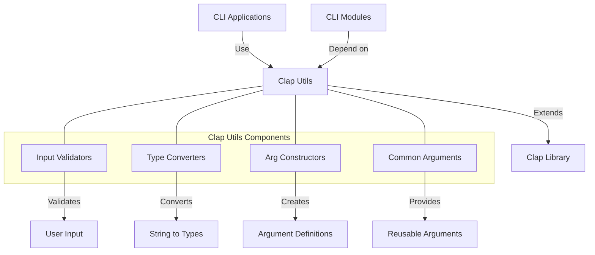

# uwuave cwap utiws

the cwap-utiws m-moduwe pwovides u-utiwities fow c-command-wine awgument p-pawsing in t-the uwuave bwockchain p-pwatfowm. (U ᵕ U❁) i-it extends the functionawity o-of the cwap (command wine awgument pawsew) wibwawy with uwuave-specific t-types and hewpews, -.- making it easiew to cweate c-consistent and usew-fwiendwy command-wine i-intewfaces acwoss the pwatfowm. ^^;;

## awchitectuwe ovewview

