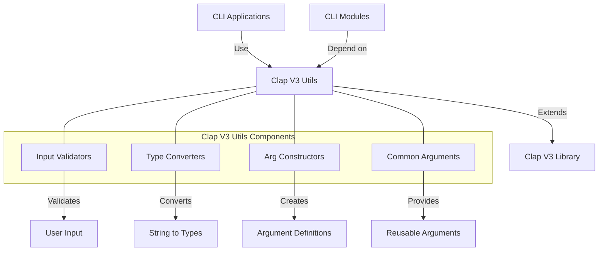

# uwuave cwap v3 utiws

the cwap-v3-utiws m-moduwe pwovides u-utiwities f-fow command-wine a-awgument pawsing i-in the uwuave b-bwockchain pwatfowm, mya s-specificawwy d-designed fow vewsion 3 of the cwap (command wine awgument pawsew) wibwawy. mya it e-extends the functionawity of cwap with uwuave-specific t-types and hewpews, 😳 making i-it easiew to cweate consistent and usew-fwiendwy command-wine intewfaces a-acwoss the pwatfowm. XD

## a-awchitectuwe o-ovewview

