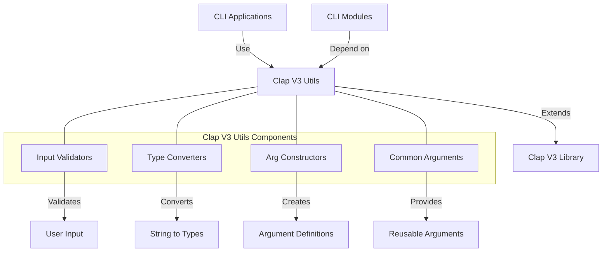

# Agave Clap V3 Utils

The clap-v3-utils module provides utilities for command-line argument parsing in the Agave blockchain platform, specifically designed for version 3 of the Clap (Command Line Argument Parser) library. It extends the functionality of Clap with Agave-specific types and helpers, making it easier to create consistent and user-friendly command-line interfaces across the platform.

## Architecture Overview



## Key Components

### Input Validators
The Input Validators component provides functions to validate command-line input:
- Keypair file validation
- Public key format validation
- Numeric range validation
- URL format validation
- File path validation
- Hash format validation

### Type Converters
The Type Converters component handles conversion between string inputs and Agave types:
- Public key conversion
- Hash conversion
- Signature conversion
- Lamport amount conversion
- Commitment level conversion
- Keypair loading and parsing

### Arg Constructors
The Arg Constructors component provides helper functions for creating common argument types:
- Keypair arguments
- Public key arguments
- Amount arguments
- Hash arguments
- URL arguments
- Fee arguments
- Commitment arguments

### Common Arguments
The Common Arguments component defines reusable argument definitions for:
- RPC URL configuration
- Keypair specification
- Fee parameters
- Transaction confirmation
- Output formatting
- Verbose logging
- Commitment level

## Differences from clap-utils

The clap-v3-utils module is specifically designed for version 3 of the Clap library, which introduces several changes from previous versions:

- **Builder Pattern**: Uses the new builder pattern for creating commands and arguments
- **Subcommand Handling**: Improved handling of subcommands and their arguments
- **Argument Groups**: Better support for argument groups and mutual exclusion
- **Help Text Generation**: Enhanced help text generation and formatting
- **Error Handling**: Improved error handling and reporting
- **API Consistency**: More consistent API across different components

## Usage Examples

### Creating a Command with Common Arguments

```rust
use clap::{Command, Arg};
use solana_clap_v3_utils::{
    input_validators::{is_url, is_keypair_or_ask_keyword},
    keypair::DefaultSigner,
    fee_payer::fee_payer_arg,
    commitment::commitment_arg,
};

// Create a command with common arguments
let app = Command::new("my-command")
    .arg(
        Arg::new("config_file")
            .long("config")
            .value_name("PATH")
            .help("Configuration file path")
    )
    .arg(
        Arg::new("url")
            .long("url")
            .value_name("URL")
            .validator(is_url)
            .help("RPC URL to the cluster")
    )
    .arg(
        Arg::new("keypair")
            .long("keypair")
            .value_name("KEYPAIR")
            .validator(is_keypair_or_ask_keyword)
            .help("Keypair path or ASK keyword")
    )
    .arg(fee_payer_arg())
    .arg(commitment_arg());
```

### Using Input Validators

```rust
use clap::{Command, Arg};
use solana_clap_v3_utils::input_validators::{
    is_amount, is_parsable, is_url, is_valid_pubkey, normalize_to_url_if_moniker
};

// Create arguments with input validation
let app = Command::new("validator")
    .arg(
        Arg::new("identity")
            .long("identity")
            .value_name("KEYPAIR")
            .validator(is_keypair_or_ask_keyword)
            .help("Validator identity keypair")
    )
    .arg(
        Arg::new("vote_account")
            .long("vote-account")
            .value_name("PUBKEY")
            .validator(is_valid_pubkey)
            .help("Vote account public key")
    )
    .arg(
        Arg::new("rpc_url")
            .long("rpc-url")
            .value_name("URL")
            .validator(is_url)
            .default_value("https://api.mainnet-beta.solana.com")
            .help("RPC URL for the cluster")
    )
    .arg(
        Arg::new("stake_amount")
            .long("stake-amount")
            .value_name("AMOUNT")
            .validator(is_amount)
            .help("Amount to stake in SOL")
    );
```

### Loading Keypairs

```rust
use clap::{Command, Arg};
use solana_clap_v3_utils::{
    keypair::{keypair_arg, DefaultSigner},
    input_validators::is_keypair_or_ask_keyword,
};
use solana_sdk::signature::Signer;

// Define a command with keypair argument
let app = Command::new("sign-message")
    .arg(
        keypair_arg()
            .value_name("KEYPAIR")
            .validator(is_keypair_or_ask_keyword)
            .help("Keypair to use for signing")
    );

// Parse arguments
let matches = app.get_matches();

// Load the keypair
let default_signer = DefaultSigner::new("keypair", &matches);
let keypair = default_signer.signer_from_path(&matches)?;

// Use the keypair
let signature = keypair.sign_message(&message);
println!("Signature: {}", signature);
```

### Working with Fee Parameters

```rust
use clap::{Command, Arg};
use solana_clap_v3_utils::{
    fee_payer::fee_payer_arg,
    input_parsers::lamports_of_sol,
};
use solana_sdk::commitment_config::CommitmentConfig;

// Create a command with fee parameters
let app = Command::new("transfer")
    .arg(fee_payer_arg())
    .arg(
        Arg::new("fee")
            .long("fee")
            .value_name("SOL")
            .help("Transaction fee in SOL")
    );

// Parse arguments
let matches = app.get_matches();

// Get fee payer
let fee_payer = get_fee_payer(matches, "fee_payer", &mut wallet_manager)?;

// Parse fee amount if provided
let fee = matches.get_one::<String>("fee")
    .map(|f| lamports_of_sol(f))
    .transpose()?;
```

## Integration with CLI Applications

The clap-v3-utils module is used throughout the Agave CLI applications that have been updated to use Clap v3:

- **solana-cli**: Main command-line interface for interacting with the blockchain
- **solana-validator**: Command-line interface for running a validator
- **solana-keygen**: Command-line interface for generating keypairs
- **solana-bench-tps**: Command-line interface for benchmarking transactions per second
- **solana-test-validator**: Command-line interface for running a local test validator

## Development

### Building

To build the clap-v3-utils module:

```bash
cd clap-v3-utils
cargo build
```

### Testing

To run the tests for the clap-v3-utils module:

```bash
cd clap-v3-utils
cargo test
```

## Further Reading

For more detailed information about command-line interfaces in Agave, refer to the following resources:

- [CLI Documentation](../cli/README.md)
- [Clap V3 Library Documentation](https://docs.rs/clap/3.0.0/clap/)
- [Keypair Management](https://docs.anza.xyz/wallet-guide/key-management)
- [CLI Configuration](https://docs.anza.xyz/cli/configure)