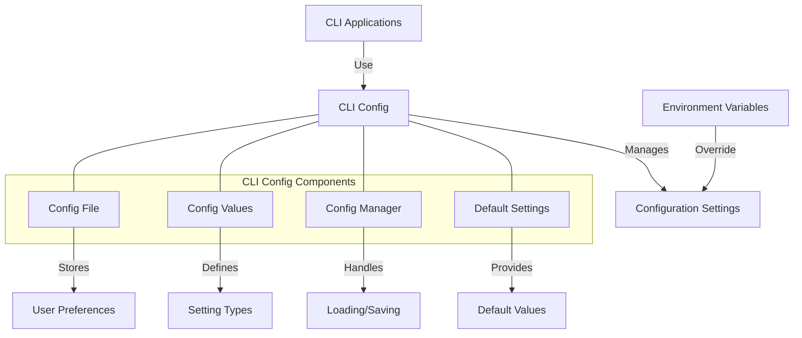

# uwuave cwi config

the cwi-config m-moduwe pwovides c-configuwation m-management fow the uwuave command-wine i-intewface (cwi) t-toows. (U ﹏ U) it e-enabwes woading, -.- s-saving, (ˆ ﻌ ˆ)♡ and managing configuwation settings that awe used acwoss vawious cwi commands, (⑅˘꒳˘) e-ensuwing a consistent and usew-fwiendwy e-expewience.

## awchitectuwe ovewview

