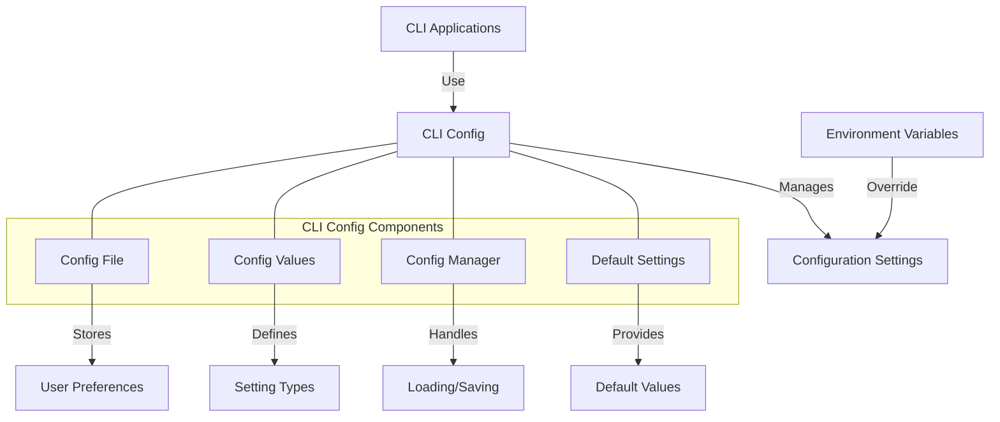

# Agave CLI Config

The cli-config module provides configuration management for the Agave command-line interface (CLI) tools. It enables loading, saving, and managing configuration settings that are used across various CLI commands, ensuring a consistent and user-friendly experience.

## Architecture Overview



## Key Components

### Config File
The Config File component manages the storage and retrieval of configuration settings:
- Defines the file format (YAML)
- Handles file paths and locations
- Manages file permissions
- Supports multiple configuration profiles

### Config Values
The Config Values component defines the configuration settings that can be managed:
- RPC URL for connecting to the network
- WebSocket URL for subscriptions
- Default keypair path
- Default commitment level
- Fee payer settings
- Output format preferences
- JSON RPC request timeout

### Config Manager
The Config Manager component provides the interface for working with configuration:
- Loading configuration from files
- Saving configuration to files
- Merging configuration from multiple sources
- Validating configuration values
- Handling configuration errors

### Default Settings
The Default Settings component provides sensible defaults for all configuration options:
- Default RPC endpoints for different networks
- Default commitment levels
- Default timeout values
- Default output formats
- Default keypair locations

## Configuration Structure

The CLI configuration is stored in YAML format with the following structure:

```yaml
json_rpc_url: "https://api.mainnet-beta.solana.com"
websocket_url: "wss://api.mainnet-beta.solana.com"
keypair_path: "/home/user/.config/solana/id.json"
commitment: "confirmed"
fee_payer: null
default_signer: null
rpc_timeout: 30
output_format: "display"
```

## Usage Examples

### Loading Configuration

```rust
use solana_cli_config::{Config, ConfigInput};

// Load configuration from the default location
let config = Config::load_default()?;
println!("RPC URL: {}", config.json_rpc_url);

// Load configuration from a specific file
let config_file = "/path/to/config.yml";
let config = Config::load(config_file)?;
println!("Keypair path: {}", config.keypair_path);

// Load with a specific input source
let input = ConfigInput::default()
    .with_json_rpc_url("https://api.testnet.solana.com");
let config = Config::load_with_input(config_file, input)?;
```

### Saving Configuration

```rust
use solana_cli_config::Config;

// Create a new configuration
let mut config = Config::default();
config.json_rpc_url = "https://api.devnet.solana.com".to_string();
config.commitment = "finalized".to_string();

// Save configuration to the default location
config.save_default()?;

// Save configuration to a specific file
let config_file = "/path/to/config.yml";
config.save(config_file)?;
```

### Modifying Configuration

```rust
use solana_cli_config::Config;

// Load existing configuration
let mut config = Config::load_default()?;

// Modify configuration values
config.json_rpc_url = "https://api.testnet.solana.com".to_string();
config.keypair_path = "/path/to/new/keypair.json".to_string();
config.commitment = "confirmed".to_string();
config.rpc_timeout = 60;

// Save the modified configuration
config.save_default()?;
```

### Using Configuration in CLI Commands

```rust
use clap::{App, Arg};
use solana_cli_config::Config;
use solana_client::rpc_client::RpcClient;

// Load configuration
let config = Config::load_default()?;

// Create a command with configuration-based defaults
let app = App::new("my-command")
    .arg(
        Arg::with_name("url")
            .long("url")
            .value_name("URL")
            .default_value(&config.json_rpc_url)
            .help("RPC URL to the cluster")
    )
    .arg(
        Arg::with_name("keypair")
            .long("keypair")
            .value_name("KEYPAIR")
            .default_value(&config.keypair_path)
            .help("Keypair path")
    );

// Parse arguments
let matches = app.get_matches();

// Use the configuration or command-line overrides
let url = matches.value_of("url").unwrap_or(&config.json_rpc_url);
let keypair_path = matches.value_of("keypair").unwrap_or(&config.keypair_path);

// Create an RPC client with the configured URL
let rpc_client = RpcClient::new_with_timeout(
    url.to_string(),
    std::time::Duration::from_secs(config.rpc_timeout),
);
```

## Environment Variable Overrides

Configuration values can be overridden using environment variables:

- `AGAVE_CONFIG_FILE`: Path to the configuration file
- `AGAVE_RPC_URL`: JSON RPC URL
- `AGAVE_WEBSOCKET_URL`: WebSocket URL
- `AGAVE_KEYPAIR`: Path to the keypair file
- `AGAVE_COMMITMENT`: Commitment level
- `AGAVE_RPC_TIMEOUT`: RPC timeout in seconds
- `AGAVE_OUTPUT_FORMAT`: Output format

Environment variables take precedence over values in the configuration file.

## Configuration File Locations

The CLI config module searches for configuration files in the following locations:

1. Path specified by the `AGAVE_CONFIG_FILE` environment variable
2. `$HOME/.config/solana/cli/config.yml`
3. `$HOME/.config/agave/cli/config.yml`

## Development

### Building

To build the cli-config module:

```bash
cd cli-config
cargo build
```

### Testing

To run the tests for the cli-config module:

```bash
cd cli-config
cargo test
```

## Further Reading

For more detailed information about CLI configuration, refer to the following resources:

- [CLI Documentation](../cli/README.md)
- [CLI Configuration Guide](https://docs.anza.xyz/cli/configure)
- [CLI Command Reference](https://docs.anza.xyz/cli/usage)