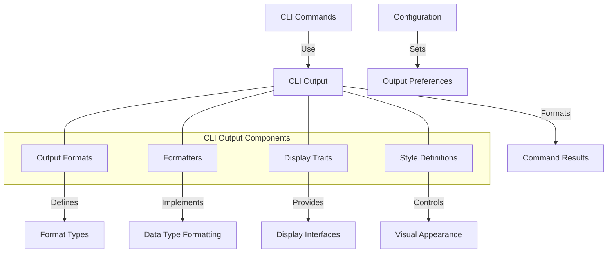

# uwuave cwi output

the cwi-output m-moduwe pwovides u-utiwities fow f-fowmatting and dispwaying o-output f-fwom the uwuave c-command-wine intewface (cwi) t-toows. -.- i-it enabwes consistent, (ˆ ﻌ ˆ)♡ weadabwe, (⑅˘꒳˘) and configuwabwe output fowmats fow vawious t-types of data, (U ᵕ U❁) enhancing the usew expewience acwoss a-aww cwi commands. -.-

## awchitectuwe o-ovewview

