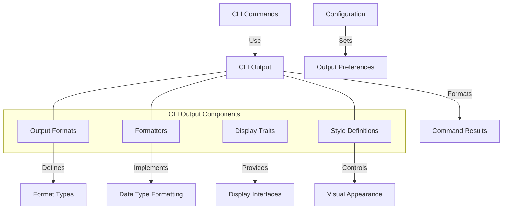

# Agave CLI Output

The cli-output module provides utilities for formatting and displaying output from the Agave command-line interface (CLI) tools. It enables consistent, readable, and configurable output formats for various types of data, enhancing the user experience across all CLI commands.

## Architecture Overview



## Key Components

### Output Formats
The Output Formats component defines the available output formats:
- **Display**: Human-readable formatted output
- **JSON**: Machine-readable JSON format
- **YAML**: Human and machine-readable YAML format
- **CSV**: Tabular data in comma-separated values format

### Formatters
The Formatters component provides specialized formatting for different data types:
- Account data formatting
- Transaction formatting
- Balance and lamport formatting
- Keypair and signature formatting
- Block and slot formatting
- Program output formatting

### Display Traits
The Display Traits component defines interfaces for displaying different types of data:
- `CliDisplay`: Trait for types that can be displayed in the CLI
- `CliTyped`: Trait for types that have a specific CLI representation
- `QuietDisplay`: Trait for minimal output display
- `VerboseDisplay`: Trait for detailed output display

### Style Definitions
The Style Definitions component controls the visual appearance of CLI output:
- Color schemes for different data types
- Styling for success, warning, and error messages
- Table formatting styles
- Progress indicator styles
- Header and footer styles

## Output Format Types

The cli-output module supports several output formats:

### Display Format
Human-readable formatted output with colors, tables, and structured presentation:
```
Balance: 100.000000000 SOL
```

### JSON Format
Machine-readable JSON format for programmatic consumption:
```json
{
  "balance": 100000000000,
  "balanceInSol": 100.0,
  "unit": "SOL"
}
```

### YAML Format
Human and machine-readable YAML format:
```yaml
balance: 100000000000
balanceInSol: 100.0
unit: SOL
```

### CSV Format
Tabular data in comma-separated values format:
```
"balance","balanceInSol","unit"
100000000000,100.0,"SOL"
```

## Usage Examples

### Implementing Display Traits

```rust
use solana_cli_output::{
    cli_output::{CliDisplay, OutputFormat},
    display::writeln_name_value,
};
use std::fmt;

// Define a struct to display
struct AccountBalance {
    address: String,
    lamports: u64,
}

// Implement the CliDisplay trait
impl CliDisplay for AccountBalance {
    fn write_cli(&self, f: &mut fmt::Formatter) -> fmt::Result {
        writeln_name_value(f, "Address:", &self.address)?;
        writeln_name_value(
            f,
            "Balance:",
            &format!("{} SOL", lamports_to_sol(self.lamports)),
        )
    }
}

// Use the display trait
let balance = AccountBalance {
    address: "83astBRguLMdt2h5U1Tpdq5tjFoJ6noeGwaY3mDLVcri".to_string(),
    lamports: 100_000_000_000,
};

// Display in different formats
println!("{}", balance.display_as(OutputFormat::Display));
println!("{}", balance.display_as(OutputFormat::Json));
println!("{}", balance.display_as(OutputFormat::Yaml));
```

### Formatting Account Data

```rust
use solana_cli_output::{
    cli_output::OutputFormat,
    account::{AccountDisplay, AccountDisplayFormat},
};
use solana_sdk::account::Account;

// Get account data
let account = /* get account */;

// Create an account display with different formats
let display = AccountDisplay {
    account: &account,
    format: AccountDisplayFormat::Json,
    encoding: UiAccountEncoding::Base64,
    data_slice: None,
};

// Display the account
println!("{}", display);

// Display with a different output format
let yaml_display = AccountDisplay {
    account: &account,
    format: AccountDisplayFormat::Yaml,
    encoding: UiAccountEncoding::Base64,
    data_slice: None,
};
println!("{}", yaml_display);
```

### Formatting Transaction Output

```rust
use solana_cli_output::{
    cli_output::OutputFormat,
    transaction::TransactionDisplay,
};
use solana_sdk::transaction::Transaction;

// Get transaction data
let transaction = /* get transaction */;
let signature = /* get signature */;

// Create a transaction display
let display = TransactionDisplay {
    transaction: &transaction,
    signature: &signature,
    output_format: OutputFormat::Display,
};

// Display the transaction
println!("{}", display);
```

### Using Style Definitions

```rust
use solana_cli_output::style::{
    style_error, style_success, style_warning,
    header_style, footer_style, title_style,
};

// Display styled output
println!("{}", style_success("Operation successful"));
println!("{}", style_warning("Warning: Low balance"));
println!("{}", style_error("Error: Transaction failed"));

// Display styled headers and footers
println!("{}", header_style("ACCOUNT INFORMATION"));
// ... account details ...
println!("{}", footer_style("End of account information"));

// Display styled titles
println!("{}", title_style("Transaction Details"));
```

## Integration with CLI Commands

The cli-output module is used throughout the Agave CLI commands to provide consistent output formatting:

- **solana-cli**: Main command-line interface for interacting with the blockchain
- **solana-validator**: Command-line interface for running a validator
- **solana-keygen**: Command-line interface for generating keypairs
- **solana-bench-tps**: Command-line interface for benchmarking transactions per second

## Configuration

The output format can be configured through:

- Command-line arguments: `--output json`, `--output yaml`
- Environment variables: `AGAVE_OUTPUT_FORMAT=json`
- Configuration file: `output_format: "json"`

The default output format is "display" for human-readable output.

## Development

### Building

To build the cli-output module:

```bash
cd cli-output
cargo build
```

### Testing

To run the tests for the cli-output module:

```bash
cd cli-output
cargo test
```

## Further Reading

For more detailed information about CLI output formatting, refer to the following resources:

- [CLI Documentation](../cli/README.md)
- [CLI Configuration Guide](https://docs.anza.xyz/cli/configure)
- [CLI Command Reference](https://docs.anza.xyz/cli/usage)