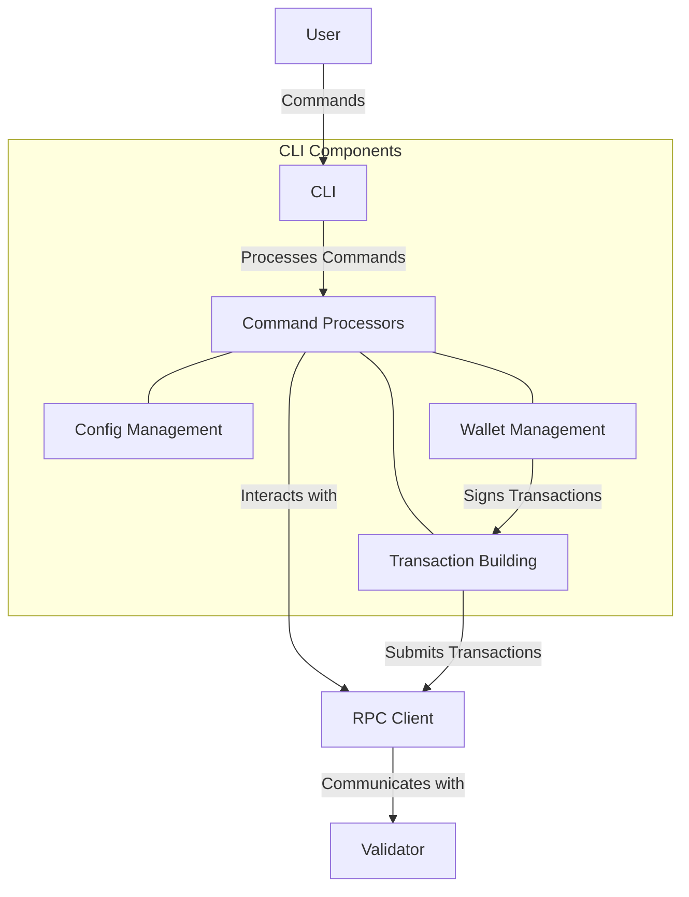

# Agave CLI (Command Line Interface)

The CLI module provides command-line tools for interacting with the Agave blockchain. It enables various operations such as managing wallets, submitting transactions, querying account information, and managing validator nodes.

## Architecture Overview



## Key Components

### Command Processors
Command processors handle the various CLI commands, parse arguments, and execute the corresponding functionality. Each command has a dedicated processor that implements its specific logic.

### Config Management
The config management component handles the CLI configuration, including RPC endpoints, default keypairs, and output formats. It allows users to customize their CLI experience.

### Wallet Management
The wallet management component handles keypair generation, storage, and management. It provides secure storage for keypairs and supports various wallet formats.

### Transaction Building
The transaction building component constructs transactions based on user commands, signs them with the appropriate keypairs, and submits them to the network.

## Command Categories

The CLI provides a wide range of commands for interacting with the blockchain:

### Wallet Commands
- `agave-keygen`: Generate a new keypair
- `agave-keypair`: Manage keypairs
- `agave-address`: Display and manage addresses

### Transaction Commands
- `agave transfer`: Transfer SOL between accounts
- `agave program deploy`: Deploy a program to the blockchain
- `agave program show`: Display information about a program

### Account Commands
- `agave account`: Display account information
- `agave balance`: Check the balance of an account
- `agave rent`: Calculate rent for an account

### Validator Commands
- `agave-validator`: Run a validator node
- `agave validator-info`: Manage validator information
- `agave validators`: Display information about validators

### Stake Commands
- `agave create-stake-account`: Create a stake account
- `agave delegate-stake`: Delegate stake to a validator
- `agave stake-account`: Display stake account information

### Vote Commands
- `agave create-vote-account`: Create a vote account
- `agave vote-account`: Display vote account information
- `agave vote-update-validator`: Update a vote account's validator identity

### System Commands
- `agave catchup`: Wait for a validator to catch up to the cluster
- `agave cluster-version`: Display the cluster software version
- `agave fees`: Display current transaction fees

## Usage Examples

### Generate a Keypair

```bash
agave-keygen new -o wallet.json
```

### Check Account Balance

```bash
agave balance --keypair wallet.json
```

### Transfer SOL

```bash
agave transfer recipient_address 1 --keypair wallet.json
```

### Deploy a Program

```bash
agave program deploy program.so --keypair wallet.json
```

### Create a Stake Account

```bash
agave create-stake-account --from wallet.json stake-account.json 100
```

### Delegate Stake

```bash
agave delegate-stake stake-account.json validator-vote-account --keypair wallet.json
```

## Configuration

The CLI can be configured via a configuration file or environment variables:

### Configuration File
The default configuration file is located at `~/.config/agave/cli/config.yml` and can contain the following settings:

```yaml
json_rpc_url: "http://localhost:8899"
websocket_url: "ws://localhost:8900"
keypair_path: "/path/to/default/keypair.json"
commitment: "confirmed"
```

### Environment Variables
The following environment variables can be used to override configuration settings:

- `AGAVE_CONFIG_FILE`: Path to the configuration file
- `AGAVE_RPC_URL`: URL of the JSON RPC endpoint
- `AGAVE_WEBSOCKET_URL`: URL of the WebSocket endpoint
- `AGAVE_KEYPAIR`: Path to the default keypair
- `AGAVE_COMMITMENT`: Default commitment level

## Development

### Building

To build the CLI module:

```bash
cd cli
cargo build
```

For a release build:

```bash
cd cli
cargo build --release
```

### Testing

To run the tests for the CLI module:

```bash
cd cli
cargo test
```

## Further Reading

For more detailed information about the CLI, refer to the following resources:

- [CLI Reference](https://docs.anza.xyz/cli)
- [Wallet Guide](https://docs.anza.xyz/wallet-guide)
- [Command Line Conventions](https://docs.anza.xyz/cli/conventions)