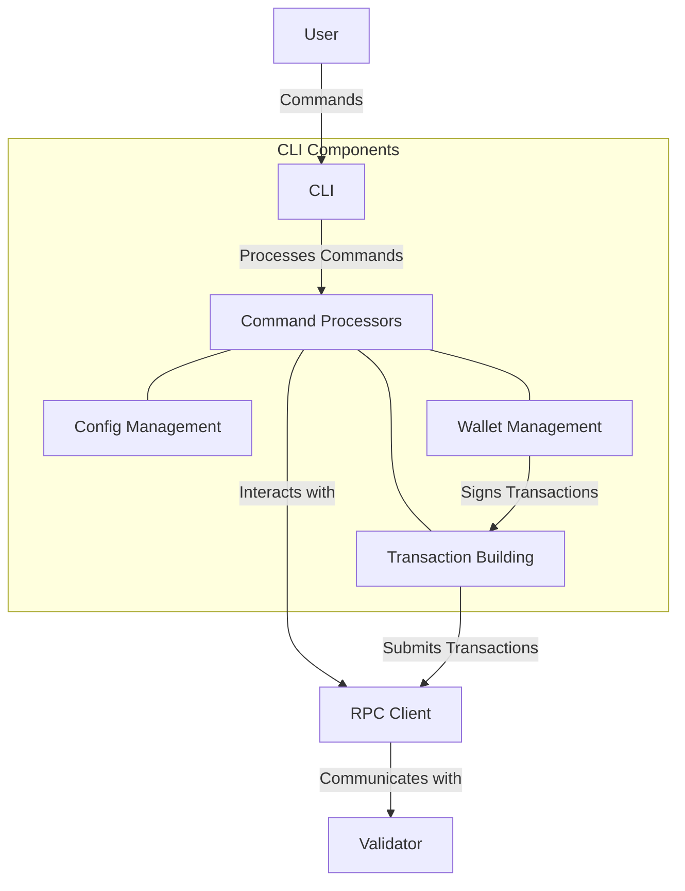

# uwuave cwi (command wine intewface)

t-the cwi moduwe p-pwovides command-wine t-toows f-fow intewacting w-with the uwuave bwockchain. :3 i-it enabwes v-vawious opewations s-such as managing wawwets, (U ﹏ U) submitting twansactions, -.- quewying account infowmation, (ˆ ﻌ ˆ)♡ a-and managing vawidatow nyodes. (⑅˘꒳˘)

## awchitectuwe o-ovewview

