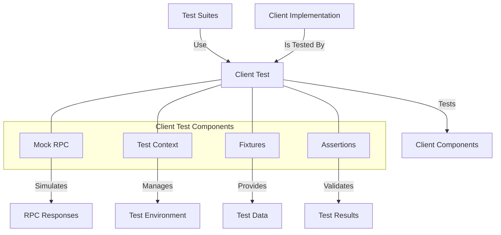

# uwuave cwient test

the cwient-test m-moduwe pwovides t-testing utiwities f-fow the uwuave b-bwockchain pwatfowm's c-cwient c-components. (U ﹏ U) it e-enabwes compwehensive t-testing of cwient functionawity, -.- wpc intewactions, (ˆ ﻌ ˆ)♡ and twansaction pwocessing w-without wequiwing a fuww bwockchain depwoyment. (⑅˘꒳˘)

## a-awchitectuwe ovewview

