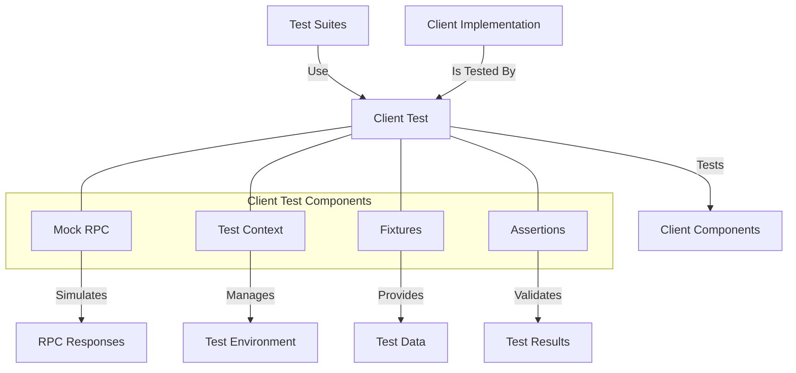

# Agave Client Test

The client-test module provides testing utilities for the Agave blockchain platform's client components. It enables comprehensive testing of client functionality, RPC interactions, and transaction processing without requiring a full blockchain deployment.

## Architecture Overview



## Key Components

### Mock RPC
The Mock RPC component simulates the RPC server for testing:
- Provides mock responses to RPC requests
- Simulates various network conditions
- Records RPC calls for verification
- Supports custom response handlers
- Simulates error conditions

### Test Context
The Test Context component manages the test environment:
- Sets up test prerequisites
- Manages test state
- Provides access to test resources
- Handles test cleanup
- Configures test parameters

### Fixtures
The Fixtures component provides test data:
- Sample accounts and keypairs
- Test transactions
- Predefined blockchain states
- Sample blocks and slots
- Test programs and instructions

### Assertions
The Assertions component validates test results:
- Verifies RPC call parameters
- Validates transaction processing
- Checks account state changes
- Verifies error handling
- Validates timing and performance

## Usage Examples

### Creating a Mock RPC Server

```rust
use solana_client_test::mock_rpc::MockRpcServer;
use solana_client::rpc_client::RpcClient;

// Create a mock RPC server
let mock_rpc = MockRpcServer::new();

// Configure mock responses
mock_rpc.add_response("getBalance", json!(50));
mock_rpc.add_response("getRecentBlockhash", json!({
    "blockhash": "CSymwgTNX1j3E4qhKfJAUE41nBWEwXufoYryPbkde5RR",
    "feeCalculator": {
        "lamportsPerSignature": 5000
    }
}));

// Get the server URL
let rpc_url = mock_rpc.url();

// Create a client that connects to the mock server
let client = RpcClient::new(rpc_url);

// Use the client in tests
let balance = client.get_balance(&pubkey)?;
assert_eq!(balance, 50);

// Verify RPC calls
let calls = mock_rpc.get_calls();
assert_eq!(calls.len(), 1);
assert_eq!(calls[0].method, "getBalance");
```

### Using Test Context

```rust
use solana_client_test::{
    test_context::TestContext,
    test_config::TestConfig,
};

// Create a test configuration
let config = TestConfig {
    num_validators: 1,
    num_clients: 2,
    ..TestConfig::default()
};

// Create a test context
let context = TestContext::new(config)?;

// Access test resources
let client = context.clients[0].clone();
let validator = &context.validators[0];

// Perform test operations
let blockhash = client.get_latest_blockhash()?;
let signature = client.send_transaction(&transaction)?;

// Clean up test resources
context.close()?;
```

### Using Fixtures

```rust
use solana_client_test::fixtures::{
    create_test_account,
    create_test_transaction,
    create_test_keypair,
};

// Create test keypairs
let payer = create_test_keypair(0);
let recipient = create_test_keypair(1);

// Create a test account
let account = create_test_account(
    &payer.pubkey(),
    100_000_000, // 0.1 SOL
    vec![1, 2, 3, 4], // Account data
    &program_id,
);

// Create a test transaction
let transaction = create_test_transaction(
    &payer,
    &[instruction],
    blockhash,
);
```

### Using Assertions

```rust
use solana_client_test::assertions::{
    assert_transaction_success,
    assert_account_balance,
    assert_rpc_call_count,
};

// Assert transaction success
assert_transaction_success(&client, &signature)?;

// Assert account balance
assert_account_balance(&client, &account_pubkey, expected_balance)?;

// Assert RPC call count
assert_rpc_call_count(&mock_rpc, "getBalance", 1);
```

## Integration with Test Frameworks

The client-test module integrates with various test frameworks:

- **Unit Tests**: For testing individual client components
- **Integration Tests**: For testing client interactions with other components
- **End-to-End Tests**: For testing complete client workflows
- **Performance Tests**: For measuring client performance
- **Stress Tests**: For testing client behavior under load

## Configuration

The client-test module can be configured with various parameters:

- **Test Environment**: Local, testnet, or simulated
- **Network Conditions**: Latency, packet loss, bandwidth
- **Validator Configuration**: Number of validators, stake distribution
- **Client Configuration**: Number of clients, connection parameters
- **Test Duration**: How long tests should run
- **Log Level**: Verbosity of test logs

## Development

### Building

To build the client-test module:

```bash
cd client-test
cargo build
```

### Testing

To run the tests for the client-test module:

```bash
cd client-test
cargo test
```

## Further Reading

For more detailed information about client testing, refer to the following resources:

- [Client Documentation](../client/README.md)
- [RPC API Reference](https://docs.anza.xyz/api/http)
- [Transaction Processing](https://docs.anza.xyz/validator/transaction-processing)
- [Test Validator Documentation](../test-validator/README.md)