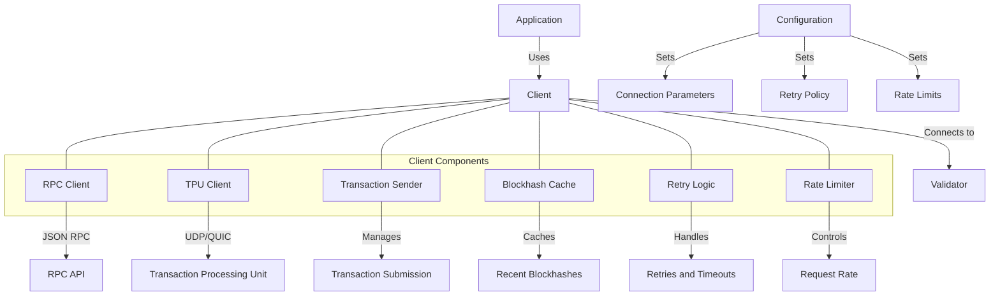

# Agave Client

The client module provides a comprehensive interface for interacting with the Agave blockchain network. It enables applications to connect to validators, submit transactions, query account information, and subscribe to blockchain events.

## Architecture Overview



## Key Components

### RPC Client
The RPC Client component provides methods for interacting with the Agave blockchain via JSON RPC:
- Querying account information
- Retrieving transaction status
- Getting block and slot information
- Subscribing to account updates and other events
- Managing program accounts

### TPU Client
The TPU Client component enables direct submission of transactions to a validator's Transaction Processing Unit (TPU):
- Faster transaction submission compared to RPC
- Support for both UDP and QUIC protocols
- Automatic leader selection for optimal transaction routing
- Connection pooling for efficient resource usage

### Transaction Sender
The Transaction Sender component handles the transaction submission process:
- Prepares transactions with recent blockhashes
- Signs transactions with the appropriate keypairs
- Submits transactions through the most efficient channel
- Tracks transaction status and confirmations

### Blockhash Cache
The Blockhash Cache component manages recent blockhashes:
- Caches recent blockhashes to avoid frequent RPC calls
- Tracks blockhash expiration
- Provides blockhashes for transaction signing
- Automatically refreshes when needed

### Retry Logic
The Retry Logic component handles transaction submission retries:
- Implements exponential backoff for failed submissions
- Detects and handles various error conditions
- Resubmits transactions with updated blockhashes when necessary
- Provides configurable retry policies

### Rate Limiter
The Rate Limiter component controls the rate of requests to the network:
- Prevents overwhelming validators with too many requests
- Implements token bucket algorithm for rate limiting
- Provides configurable rate limits
- Prioritizes critical requests

## Usage Examples

### Creating a Client

```rust
use solana_client::rpc_client::RpcClient;
use solana_sdk::commitment_config::CommitmentConfig;

// Create a client with default configuration
let client = RpcClient::new("https://api.mainnet-beta.solana.com");

// Create a client with specific commitment level
let client = RpcClient::new_with_commitment(
    "https://api.devnet.solana.com",
    CommitmentConfig::confirmed(),
);

// Create a client with timeout and commitment
let client = RpcClient::new_with_timeout_and_commitment(
    "https://api.testnet.solana.com",
    std::time::Duration::from_secs(30),
    CommitmentConfig::finalized(),
);
```

### Querying Account Information

```rust
use solana_client::rpc_client::RpcClient;
use solana_sdk::pubkey::Pubkey;

// Create a client
let client = RpcClient::new("https://api.devnet.solana.com");

// Get account information
let pubkey = Pubkey::from_str("83astBRguLMdt2h5U1Tpdq5tjFoJ6noeGwaY3mDLVcri").unwrap();
let account = client.get_account(&pubkey)?;

println!("Account balance: {}", account.lamports);
println!("Account owner: {}", account.owner);
println!("Account data length: {}", account.data.len());
```

### Sending a Transaction

```rust
use solana_client::rpc_client::RpcClient;
use solana_sdk::{
    signature::{Keypair, Signer},
    system_instruction,
    transaction::Transaction,
};

// Create a client
let client = RpcClient::new("https://api.devnet.solana.com");

// Create a transaction
let sender = Keypair::from_bytes(&sender_bytes)?;
let recipient = Pubkey::from_str("83astBRguLMdt2h5U1Tpdq5tjFoJ6noeGwaY3mDLVcri").unwrap();
let amount = 1_000_000; // 0.001 SOL in lamports

let instruction = system_instruction::transfer(
    &sender.pubkey(),
    &recipient,
    amount,
);

let recent_blockhash = client.get_latest_blockhash()?;
let transaction = Transaction::new_signed_with_payer(
    &[instruction],
    Some(&sender.pubkey()),
    &[&sender],
    recent_blockhash,
);

// Send the transaction
let signature = client.send_and_confirm_transaction(&transaction)?;
println!("Transaction signature: {}", signature);
```

### Using TPU Client for Direct Transaction Submission

```rust
use solana_client::tpu_client::{TpuClient, TpuClientConfig};
use solana_sdk::{
    signature::{Keypair, Signer},
    system_instruction,
    transaction::Transaction,
};

// Create a TPU client
let tpu_client = TpuClient::new(
    "https://api.devnet.solana.com",
    TpuClientConfig::default(),
)?;

// Create a transaction
let sender = Keypair::from_bytes(&sender_bytes)?;
let recipient = Pubkey::from_str("83astBRguLMdt2h5U1Tpdq5tjFoJ6noeGwaY3mDLVcri").unwrap();
let amount = 1_000_000; // 0.001 SOL in lamports

let instruction = system_instruction::transfer(
    &sender.pubkey(),
    &recipient,
    amount,
);

let recent_blockhash = tpu_client.get_latest_blockhash()?;
let transaction = Transaction::new_signed_with_payer(
    &[instruction],
    Some(&sender.pubkey()),
    &[&sender],
    recent_blockhash,
);

// Send the transaction directly to the TPU
let signature = tpu_client.send_and_confirm_transaction(&transaction)?;
println!("Transaction signature: {}", signature);
```

### Subscribing to Account Updates

```rust
use solana_client::{
    rpc_client::RpcClient,
    rpc_config::RpcAccountInfoConfig,
    rpc_response::RpcKeyedAccount,
};
use solana_sdk::commitment_config::CommitmentConfig;
use std::sync::mpsc::channel;

// Create a client
let client = RpcClient::new("https://api.devnet.solana.com");

// Create a channel for receiving updates
let (sender, receiver) = channel();

// Subscribe to account updates
let pubkey = Pubkey::from_str("83astBRguLMdt2h5U1Tpdq5tjFoJ6noeGwaY3mDLVcri").unwrap();
let subscription_id = client.account_subscribe(
    &pubkey,
    sender,
    RpcAccountInfoConfig {
        commitment: Some(CommitmentConfig::confirmed()),
        encoding: None,
        data_slice: None,
    },
)?;

// Process account updates
loop {
    match receiver.recv() {
        Ok(update) => {
            println!("Account updated: {:?}", update);
        }
        Err(err) => {
            println!("Error receiving update: {:?}", err);
            break;
        }
    }
}

// Unsubscribe when done
client.account_unsubscribe(subscription_id)?;
```

## Performance Considerations

The client module is designed for high performance and reliability:

- **Connection Pooling**: Reuses connections to minimize overhead
- **Parallel Processing**: Supports concurrent requests for improved throughput
- **Efficient Serialization**: Uses efficient serialization formats to minimize overhead
- **Automatic Retries**: Implements intelligent retry logic for transient failures
- **Rate Limiting**: Prevents overwhelming the network with too many requests
- **Blockhash Caching**: Reduces the need for frequent blockhash queries

Performance can be tuned through configuration:

- Adjusting timeout values for different network conditions
- Configuring retry policies for different types of operations
- Setting appropriate commitment levels for the required consistency
- Using TPU client for performance-critical applications

## Configuration

The client module can be configured with various parameters:

- **RPC URL**: The URL of the JSON RPC endpoint
- **Commitment Level**: The desired consistency level (processed, confirmed, finalized)
- **Timeout**: The maximum time to wait for a response
- **Retry Policy**: The policy for retrying failed requests
- **Rate Limits**: Limits on the number of requests per second
- **Connection Parameters**: Parameters for connection management

## Development

### Building

To build the client module:

```bash
cd client
cargo build
```

### Testing

To run the tests for the client module:

```bash
cd client
cargo test
```

## Further Reading

For more detailed information about the client module and related components, refer to the following resources:

- [RPC API Reference](https://docs.anza.xyz/api/http)
- [Transaction Processing](https://docs.anza.xyz/validator/transaction-processing)
- [Client Development Guide](https://docs.anza.xyz/developing/clients/overview)
- [TPU Architecture](https://docs.anza.xyz/validator/tpu)