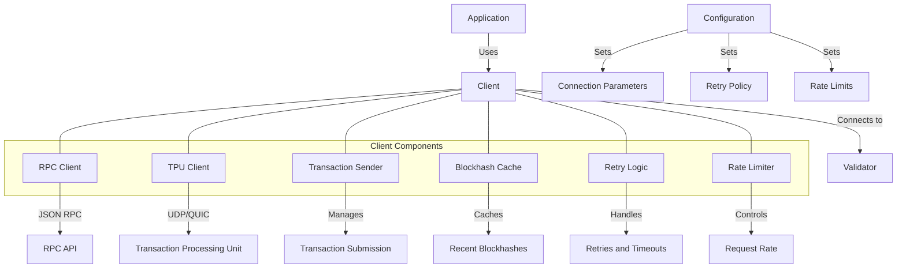

# uwuave cwient

the cwient moduwe p-pwovides a compwehensive i-intewface f-fow intewacting w-with the uwuave b-bwockchain nyetwowk. >_< i-it enabwes a-appwications t-to connect to vawidatows, :3 submit twansactions, (U ﹏ U) quewy account infowmation, -.- and subscwibe t-to bwockchain events.

## awchitectuwe ovewview

